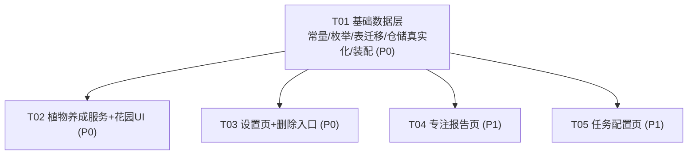

# 《向日葵专注 SunFocus》M3 架构设计 · 家长端补齐 4 页 + 植物养成（3 种 / 3 阶段）

> 设计：架构师 高见远（Bob）｜输入：`MVP执行规划_v2`、`口径裁定表_v1`、`向日葵专注_PRD_v2.0`、`软件设计文档_M2`、M0–M2 代码现状侦察
> 形态纪律：Plan B 无账号单机版（C1）；`account_service` 留桩；数据模型保留 `childId`；不引入账号/云/同步；家长端本地 PIN 锁不接云账号。
> 数值纪律：所有可调数值来自 `core/constants/prd_params.dart`（或 `age_tier_params.dart`），禁止裸字面量。

---

## 1. 现状盘点

### 1.1 家长端现状（M2 已建）

| 文件 | 状态 | 说明 |
|---|---|---|
| `parent_login_page.dart` | ✅ 已建 | 本地 PIN 锁（设置/校验），进入即 `parent_dau` 埋点 |
| `parent_home_page.dart` | ✅ 已建 | **TabBar 壳，3 个 tab：今日 / 奖励 / 夸夸台** |
| `parent_today_page.dart` | ✅ 已建 | 待核销/排队列表（核销卡） |
| `parent_reward_page.dart` | ✅ 已建 | 周阳光池指示 + 奖励模板增删改 |
| `parent_praise_page.dart` | ✅ 已建 | 夸夸语录收藏（SharedPreferences） |
| `widgets/verification_card.dart` | ✅ 已建 | 核销/拒绝/立即发放（≤2 步） |
| `widgets/pool_indicator.dart` | ✅ 已建 | 周池预算输入 + 进度 + 免确认上限 |

**结论**：MVP 裁剪「保留 4 页 = 今日/夸夸台/奖励/设置」中，**设置页尚未建**；PRD §4.9 功能清单中的 **专注报告、任务配置、删除入口** 均未建。当前 home 是 3-tab，缺第 4 个 tab（设置）与 3 个独立页（报告/任务/删除）。

### 1.2 植物模块现状（桩/部分）

| 文件 | 状态 | 缺口 |
|---|---|---|
| `entities/plant.dart` | ⚠️ 部分 | 有 `stage/stageStartedAt/growthFactor/waterUsed/fertilizerUsed/status/lastWaterAt`，**缺 `plantedAt`、`growthProgress`、枯萎/死亡计时、mood**；`PlantStatus{growing,bloomed,dormant}` 与 PRD「开心/平静/口渴 + 枯萎/死亡」不一致 |
| `entities/plant_species.dart` | ⚠️ 部分 | 有 `id/name/rarity/baseCostHigh/baseCostLow/growthHoursPerStage`，**缺 `subscriptionOnly` 标记**；无种子数据 |
| `repositories/plant_repository.dart` | ⚠️ 接口桩 | 仅 `plants()/species()/savePlant()`；无 `addPlant/updatePlant/deletePlant/plant(id)`；无真实实现（M0 桩 `PlantLocalRepositoryStub` 返回空） |
| **植物服务** | ❌ 无 | 无 `PlantGrowthService` / 成长引擎 / 经济衔接 |
| **Plants 数据表** | ❌ 无 | Drift 未建 `Plants` 表（Tasks/CheckIns 表已存在，但 `TaskRepository` 仍是 M0 桩） |
| `enums.dart` | ⚠️ 部分 | `PlantStage{seed,sprout,adult}`（3 阶段，符合 MVP 裁剪 4→3 阶段）；`PlantStatus` 需重定义为生命周期态 |

### 1.3 经济侧可复用（M2 承重墙）

`SunlightService` / `SunlightRepository.append+balance`、`RedemptionOrchestrationService`、`WeeklyPoolService`、`AntiAddictionService` 均可用。植物消耗/退款统一走 `SunlightRepository.append`（append-only 账本，`refType` 区分来源），与奖励核销同源，符合 §3.2「单一账本可追溯对账」铁律。

---

## 2. 家长端补齐 4 页设计

**选型结论（最该先补的 4 页）**：**设置页 + 删除入口 + 专注报告 + 任务配置**。
理由：① 设置页是 MVP 裁剪官方第 4 页且是其余三页的入口；② 删除入口是 §10.4 C5 合规义务（G0 收口相关）；③ 专注报告支撑 G2「家长健康指标可读」；④ 任务配置是 §4.9 清单项。核销主链路已通，补齐以「完整性 + G2 可读 + 合规删除权」为主，不堆无关页。

**导航结构建议**：`parent_home_page` TabBar 改为 **4 tab：今日 / 奖励 / 夸夸台 / 设置**；设置页内含 3 个入口卡片 → 跳转 `/parent/report`、`/parent/tasks`、`/parent/delete`。这样既补齐 4 页，又使 TabBar 与 MVP 裁剪「保留 4 页」对齐，且避免 6-tab 拥挤。

### 2.1 设置页（ParentSettingsPage）— P0，第 4 个 tab

- **职责**：集中家长可控开关 + 提供「专注报告 / 任务配置 / 删除入口」三个入口 + 阳光赠予入口。
- **依赖**：`SettingsRepository`（读写 `AppSettings`）、`SecureStore`（PIN 重设，非 settings 字段）、`SunlightRepository`（阳光赠予扣减）。
- **复用 Settings 字段（全部已存在，0 新增）**：`ageTier`、`nightBoundaryHour/Minute`、`dailyFocusCap`、`dailyAppCapMinutes`、`restAfterSessions`、`restMinutes`、`quietMode`、`detectionOn`、`soundOn`、`bgmOn`、`themeDark`、`autonomousMode`。
- **新增能力（非字段）**：
  - PIN 重设：`secureStoreProvider.resetPin()`（新增 SecureStore 方法，不改 settings 表）。
  - 阳光赠予：动作，调 `SunlightRepository.append(earn, refType='parent_gift')`，**日/月上限**需新增常量 `kParentGiftDaily=20`、`kParentGiftMonthly=150`（PRD §4.5/§4.9 有数值但 `prd_params` 当前缺失 → 见 §5 待拍板 U1），上限用 `dayKey`/`monthKey` 统计当日/当月已赠予。
- **边界**：与「今日」（核销流）、「奖励」（模板+池）、「夸夸台」（语录）不重复；设置页只放配置项 + 入口，不放核销/模板编辑。

### 2.2 删除入口页（ParentDeletePage）— P0，合规 §10.4 C5

- **职责**：一键删除全部本地数据。按 PRD「先导后清」——先提示「导出成册」（M3 可仅提示，导出 UI 留 V2），确认后清空 Drift 全表 + SharedPreferences（同意标记、夸夸语录 `praise_notes_v1`）+ SecureStore PIN。
- **依赖**：`AppDatabase`（新增 `clearAll()` 或逐表 delete）+ `SettingsStore` + `SecureStore`。建议新增一个轻量 `DataManagementService`（或直接在页内调各 Repository 的 deleteAll）。
- **Settings 字段**：无新增。
- **边界**：PRD §4.9「此处只放删除入口」——本页只做删除，不放其他配置；从设置页进入。

### 2.3 专注报告页（ParentReportPage）— P1，G2 跑数可读

- **职责**：周报/月报——WFD 达成（≥4 天/周）、专注时段分布、稳定度趋势、阳光产出汇总（全部本地聚合）。
- **依赖**：`FocusRepository`（`sessionsOfDay(dayKey)`、`countValidFocusDaysLastWeek(now)` 已存在）、`SunlightRepository`（`dayNet`/`balance`）、`AppSettings`（档位阈值）。
- **复用**：WFD 口径 = 当日存在 `FocusSession` 且 `actualFocusMin≥kValidFocusMinutes(15)` 且 `completionRate≥kCompletionRateThreshold(0.90)`（与 M1/M2 一致）。
- **Settings 字段**：无新增，只读。
- **边界**：与「今日」（核销流）区分——报告是聚合回看，今日是待处理流。

### 2.4 任务配置页（ParentTaskConfigPage）— P1，§4.9

- **职责**：任务增删改、每周重复规则（`repeatRule`）、关联专注开关（`requiresFocus`/`minFocusMin`）。
- **依赖**：`TaskRepository`（M0 桩，M3 需真实化：新建 `TaskLocalRepository` 替换桩）、`Task` 实体（已存在）。
- **复用 Settings 字段**：`taskSunlight`（12，任务阳光默认值，已存在）。
- **边界**：与「奖励」页（阳光兑换模板）区分——任务配置=学习打卡模板，奖励配置=阳光兑换模板，二者不混。

### 2.5 优先级矩阵

| 页 | 优先级 | 理由 |
|---|---|---|
| 设置页 | P0 | MVP 裁剪官方第 4 页 + 其余三页入口 + 防沉迷/家长锁等开关集 |
| 删除入口 | P0 | §10.4 C5 合规义务（G0 收口相关），必须可达 |
| 专注报告 | P1 | 支撑 G2「家长健康指标可读」，M3 DoD |
| 任务配置 | P1 | §4.9 清单项；依赖 TaskRepository 真实化，工作量最大，排最后 |

---

## 3. 植物养成设计（3 种 / 3 阶段）

### 3.1 数据模型字段表（对现有实体的最小改动 diff）

**`entities/plant.dart` — 字段补齐（不推翻重来）**

| 字段 | 现状 | 改动 |
|---|---|---|
| `id` / `speciesId` / `potIndex` | 有 | 保留 |
| `stage` (PlantStage) | 有 | 保留（seed/sprout/adult = 3 阶段，符合裁剪） |
| `stageStartedAt` | 有 | 保留 |
| `growthFactor` | 有（1.0/1.3） | 保留（每次 tick 按当日 WFD 重算） |
| `waterUsed` / `fertilizerUsed` | 有（每段是否浇水/施肥） | 保留；**阶段推进时重置为 false** |
| `status` (PlantStatus) | 有 {growing,bloomed,dormant} | **重定义**为生命周期态 {growing, bloomed, wilting, dead}（dormant→wilting 语义改名；新增 dead；当前无代码引用 dormant，安全） |
| `lastWaterAt` | 有 | 保留（枯萎计时基准） |
| `plantedAt` | ❌ 缺 | **新增** DateTime（种植时间） |
| `growthProgress` | ❌ 缺 | **新增** double 0..1（当前阶段内进度） |
| `wiltedAt` | ❌ 缺 | **新增** DateTime?（枯萎计时起点；死亡/救回后清空） |
| `deadAt` | ❌ 缺 | **新增** DateTime?（死亡计时，仅供统计） |
| `mood` | ❌ 缺 | **新增** PlantMood 枚举 {happy(今日有专注), calm(平静), thirsty(口渴/未浇水)}，可由 `lastWaterAt` + 当日 WFD 推导，亦可存字段 |

**`entities/plant_species.dart` — 最小补齐**

| 字段 | 现状 | 改动 |
|---|---|---|
| `id/name/rarity/baseCostHigh/baseCostLow/growthHoursPerStage` | 有 | 保留 |
| `subscriptionOnly` | ❌ 缺 | **新增** bool（默认 false；订阅专属植物 V2 划归，M3 全部 false） |

**`enums.dart` — 枚举修正**
- `PlantStatus`：`{growing, bloomed, wilting, dead}`（原 dormant 改名 wilting，新增 dead）。
- 新增 `PlantMood { happy, calm, thirsty }`。
- `PlantStage` 维持 `{seed, sprout, adult}`（3 阶段，符合 MVP 裁剪 4→3）。

**`entities/settings.dart` — 新增 1 字段**
- `gardenPotCapacity` (int，默认 `kGardenPotDefault=4`，上限 `kGardenPotMax=12`)。用于花园容量（初始 4 → 解锁 12），避免新增独立表。

**`PlantSpecies` 种子数据（3 种，MVP 裁剪 8→3）** — 新建 `data/local/plant_seed.dart`
- 向日葵（初始，cost 0，普通/初始档，`growthHoursPerStage` 设默认值，如 24h）
- 小雏菊（普通，high 180 / low 72）
- 仙人掌（优良，high 420 / low 168）
> 具体 3 种（含是否含 1 株稀有）留产品拍板（见 §5 U2）。

### 3.2 PlantGrowthService 接口草图（新领域服务，纯 Dart 可单测）

```dart
/// 植物养成领域服务（M3）。依赖接口，零 Flutter 依赖，可被 flutter test 直接单测。
class PlantGrowthService {
  // 依赖
  final PlantRepository _plants;
  final FocusRepository _focus;
  final SunlightRepository _ledger;
  final SettingsRepository _settings;

  /// 种植：校验花盆容量 → 校验余额 ≥ 种植价 → 扣账本(refType='plant_plant') → 落 Plant。
  Future<Plant> plant(String speciesId, int potIndex, DateTime now);

  /// 计时驱动成长：对每株推进 growthProgress；满 1.0 进阶段(seed→sprout→adult)；
  /// adult+满 → status=bloomed。同时处理枯萎/死亡（见 3.4）。
  Future<List<Plant>> tickAll(DateTime now);

  /// 浇水加速：本阶段未用过 → 扣浇水价(refType='plant_water') → 剩余时间×0.7 → 重置 lastWaterAt。
  Future<void> water(String plantId, DateTime now);

  /// 施肥加速：同浇水，×0.4。与浇水二选一（每段限 1 次）。
  Future<void> fertilize(String plantId, DateTime now);

  /// 枯萎救回：status==wilting → 扣救回价(refType='plant_revive') → status=growing, wiltedAt=null, lastWaterAt=now。
  Future<void> revive(String plantId, DateTime now);

  /// 花盆扩容：capacity<12 → 扣扩容价(refType='plant_expand') → gardenPotCapacity+1。
  Future<void> expandPot(DateTime now);

  /// 当日是否有效专注日（联动 FocusRepository，口径与 M1/M2 一致）。
  bool _hasValidFocusDay(DateTime day);
}
```

- **成长速度系数**：`kGrowthFactorFocused=1.3`（PRD §4.6 H2）。tick 推进时，对跨过的每一天，若 `_hasValidFocusDay(day)` 为真则当天速率 ×1.3，否则 ×1.0。**软绑定**：即便全无专注，仍按 ×1.0 推进，绝不死亡（H2 底线）。
- **经济衔接**：所有扣减经 `SunlightRepository.append(net<0, refType)`，退款经 `append(net>0, refType='plant_death_refund')`；扣前用 `balance()` 校验。与奖励核销同账本、可追溯。

### 3.3 成长 / 枯萎 / 死亡 状态机

```
                plant()                      tickAll 进度满
   [空盆] ──────────────► [seed/growing] ───────────► [sprout/growing]
                                                        │ tickAll 进度满
                                                        ▼
                                                [adult/growing]
                                                        │ tickAll 进度满
                                                        ▼
                                                [adult/bloomed]  ← 成株（终点，仍可被浇水/枯萎）
   任意 growing 状态：
     now - lastWaterAt > kPlantWiltDays(7天)  ──► [wilting]（status=wilting, 记 wiltedAt）
     [wilting] 且 now - wiltedAt > kPlantWiltDays(7天) ──► [dead]
        ├─ dead：返还 30% 种植成本（append earn refType='plant_death_refund'）；花盆释放（可重种）
        └─ revive()：扣救回价 → 回 growing，wiltedAt=null
   water()/fertilize()：仅 growing 且本阶段未用过；加速并刷新 lastWaterAt（重置枯萎计时）
```

- **枯萎**：7 天未浇水（`kPlantWiltDays=7`）→ 状态 `wilting`，20 阳光救回（`kPlantReviveCostHigh/Low`）。
- **死亡**：再 7 天（`kPlantDeathDays=7`）→ `dead`，返还 `kPlantDeathRefundRatio=0.30` 种植成本到阳光账本（**只与养护挂钩，绝不因专注表现杀死**，H2）。
- **死亡只移出展示**：pot 释放，可重新种植；`deadAt` 仅供统计。

### 3.4 经济衔接与种植价口径（重点：待拍板）

- **消耗侧价格来源**：`PlantSpecies.baseCostHigh / baseCostLow`（实体已带）。种植价 = `tier==low ? baseCostLow : baseCostHigh`。浇水/施肥/救回/扩容价来自 **新增常量**（当前 `prd_params` 缺，见 §5 U1）：`kPlantWaterCostHigh/Low=20/8`、`kPlantFertilizeCostHigh/Low=50/20`、`kPlantReviveCostHigh/Low=20/8`、`kPlantPotExpandCostHigh/Low=400/160`。
- **C10 是否适用于植物（⚠️ 待拍板 U3）**：C10 原文裁定范围是「奖励兑换」（消耗侧 `baseCost×K` → 统一 `baseCost`）。植物 §4.6 是**独立定价表**（按稀有度 high/low 两列），与奖励 `baseCost` 不是同一套。
  - **建议**：C10 仅作用于奖励兑换链路；植物种植/养护价**保留 §4.6 两档**（它是收藏/经济平衡用的稀有度定价，刻意分档）。即 `baseCostHigh/Low` 继续按档取用。
  - **备选（若主理人要求全量统一）**：植物价也去分龄 K → 仅用单 `baseCost`（如取 `baseCostLow` 为统一价），`baseCostHigh` 弃用。改这一处即可，不推翻模型。
  - **本设计默认按「建议」落地**（保留两档），并在代码中用 `kAgeTierParams` 同款查表风格取价，避免散落三元。

### 3.5 花园容量

- 初始 4 盆 → 解锁 12 盆（`kGardenPotDefault=4`，`kGardenPotMax=12`）。
- 容量存 `AppSettings.gardenPotCapacity`（新增字段，见 3.1），`expandPot()` 扣 400/盆后 +1。C10 后是否仍按 `baseCost`：同 U3（建议保留 §4.6 两档）。

### 3.6 页面范围建议（⚠️ 待拍板 U4）

- **M3 范围建议**：交付 **domain + 孩子端花园基础 UI**——`garden_page`（植物列表卡片：阶段/进度条/浇水按钮/救回按钮）、种植入口（从物种列表选种扣费）、扩容入口。
- **图鉴 / 商店子页签（PRD §5）**：M3 做**最小版**（图鉴=静态 3 物种列表；商店子页签可并入种植入口），完整 §5 花园打磨留 M4。
- **理由**：M3 承重墙是「植物养成 domain + 经济衔接 + 家长端补齐」，UI 打磨不阻塞 G2。

---

## 4. 任务分解（有序，≤5 任务，依赖仅在 T01）

> 纪律：首任务为「基础数据层」（M3 的基础设施：常量/枚举/表/migration/仓储替换/装配），其余任务均只依赖 T01，互相独立。

| ID | 任务名 | 优先级 | 依赖 | 涉及文件（相对路径） | 复用桩 |
|---|---|---|---|---|---|
| **T01** | **基础数据层**：常量/枚举/实体补齐/表与迁移/仓储真实化/装配 | P0 | 无 | `core/constants/prd_params.dart`(改,新增植物/赠予常量)、`domain/entities/enums.dart`(改,PlantStatus/PlantMood)、`domain/entities/plant.dart`(改)、`domain/entities/plant_species.dart`(改)、`domain/entities/settings.dart`(改,+gardenPotCapacity)、`data/local/database/tables.dart`(改,+Plants表/Settings.gardenPotCapacity列)、`data/local/database/app_database.dart`(改,schemaVersion 3→4+migration)、`data/local/database/daos.dart`(改,+PlantDao/TaskDao)、`domain/repositories/plant_repository.dart`(改,扩接口)、`data/local/plant_seed.dart`(新)、`data/local/repositories/plant_local_repository.dart`(新,替换桩)、`data/local/repositories/task_local_repository.dart`(新,替换桩)、`core/di/providers.dart`(改,装配) | 替换 `PlantLocalRepositoryStub`/`TaskLocalRepositoryStub` |
| **T02** | **植物养成服务 + 孩子端花园基础 UI**：PlantGrowthService（种植/成长tick/浇水/施肥/救回/扩容/枯萎死亡退款）+ garden_page 最小实现 | P0 | T01 | `domain/services/plant_growth_service.dart`(新)、`presentation/child/pages/garden_page.dart`(新)、`presentation/child/widgets/plant_card.dart`(新)、`shared/app_router.dart`(改,+/garden 路由)、`core/di/providers.dart`(改,+plantGrowthServiceProvider) | 无（新服务） |
| **T03** | **家长端·设置页 + 删除入口**：4-tab 改造 + 设置页（开关集/PIN重设/阳光赠予入口）+ 删除入口页 | P0 | T01 | `presentation/parent/pages/parent_home_page.dart`(改,4-tab)、`presentation/parent/pages/parent_settings_page.dart`(新)、`presentation/parent/pages/parent_delete_page.dart`(新)、`data/local/secure_store.dart`(改,+resetPin)、`domain/services/data_management_service.dart`(新,清库)或页内直调、`shared/app_router.dart`(改,+/parent/delete)、`core/di/providers.dart`(改,赠予/清库装配) | 无 |
| **T04** | **家长端·专注报告页**：周/月聚合（WFD/时段分布/稳定度/阳光汇总） | P1 | T01 | `presentation/parent/pages/parent_report_page.dart`(新)、`domain/services/focus_report_service.dart`(新,聚合逻辑,复用 FocusRepository/SunlightRepository)、`shared/app_router.dart`(改,+/parent/report) | 无 |
| **T05** | **家长端·任务配置页**：任务模板增删改/重复规则/关联专注 + TaskRepository 已真实化（T01） | P1 | T01 | `presentation/parent/pages/parent_task_config_page.dart`(新)、`presentation/parent/widgets/task_editor_dialog.dart`(新)、`shared/app_router.dart`(改,+/parent/tasks) | 复用 T01 真实化 TaskRepository |

### 4.1 任务依赖图



### 4.2 里程碑内顺序建议

T01（基础层，必须最先）→ 并行 T02 / T03 / T04 / T05（均只依赖 T01，可多工程师并行）。`providers.dart` 与 `app_router.dart` 由 T01/T02/T03 各自按需改动，按 M2 约定（接口签名先行冻结）避免冲突。

---

## 5. 待拍板 / 待明确事项

| # | 事项 | 现状与建议 |
|---|---|---|
| **U1** | **阳光赠予 / 植物养护价常量缺失** | PRD §4.5/§4.6 给出数值（赠予 20日/150月；浇水 20高/8低、施肥 50高/20低、救回 20高/8低、扩容 400高/160低）但 `prd_params.dart` **当前均无对应常量**。T01 将统一补入（含 `kParentGiftDaily=20`、`kParentGiftMonthly=150`、`kPlantWaterCostHigh/Low`、`kPlantFertilizeCostHigh/Low`、`kPlantReviveCostHigh/Low`、`kPlantPotExpandCostHigh/Low`、`kPlantWiltDays=7`、`kPlantDeathDays=7`、`kPlantDeathRefundRatio=0.30`、`kGardenPotDefault=4`、`kGardenPotMax=12`）。请确认数值沿用 PRD §4.5/§4.6 原表。 |
| **U2** | **M3 植物 3 种具体选型** | PRD §4.6 列 8 免费+2 订阅；MVP 裁剪 8→3。建议：向日葵(初始/0) + 小雏菊(普通/180-72) + 仙人掌(优良/420-168)。是否含 1 株稀有(小树苗 680/272)请产品拍板。 |
| **U3** | **C10 是否覆盖植物定价** | C10 原文范围=奖励兑换。建议植物保留 §4.6 两档（稀有度经济平衡用），不套用「baseCost 统一」。若主理人要求全量去分龄，则植物价也改单 `baseCost`（取 `baseCostLow` 为统一价）。**本设计默认按「建议」**。 |
| **U4** | **花园 UI 范围** | 建议 M3 = domain + 花园基础 UI（列表/种植/浇水/救回/扩容）；图鉴/商店子页签做最小版，完整 §5 花园留 M4。请确认。 |
| **U5** | **monthKey 辅助函数** | M2 设计提到 `monthKey`，但 `core/utils/datetime_ext.dart` 仅见 `dayKey`/`weekKey`。赠予月上限与（若需）月度聚合需 `monthKey(DateTime)`（`'yyyy-MM'`），T01/T04 顺带补入。 |
| **U6** | **删除入口与「导出成册」** | §10.4 要求「先导后清」。M3 建议删除页先提示导出（导出 UI 留 V2），确认即清库。是否 M3 就要做导出成册文件，请拍板。 |
| **U7** | **家长端第 4 tab 命名** | 本文建议 TabBar=今日/奖励/夸夸台/设置，报告/任务/删除作为设置内入口路由。若主理人认为报告/任务应各自成 tab，则 TabBar 需扩至 5–6，与 MVP 裁剪「4 页」表述微调，请确认。 |

---

## 共享知识（给工程师）

1. **常量单点**：所有数值来自 `prd_params.dart` / `age_tier_params.dart`；植物/赠予新增常量由 T01 统一补入，禁止裸字面量（口径巡检清单 §7）。
2. **账本铁律**：植物所有扣减/退款经 `SunlightRepository.append`，`refType` 区分 `plant_plant/plant_water/plant_fertilize/plant_revive/plant_expand/plant_death_refund`；queued 思路不适用植物（植物即时扣费），扣前必查 `balance()`。
3. **软绑定底线**：植物成长 `×1.0`（无专注也长），有 WFD 当日 `×1.3`；**绝不因专注差而死亡**，死亡只由「7+7 天未养护」触发。
4. **WFD 口径**：`actualFocusMin≥kValidFocusMinutes(15)` 且 `completionRate≥kCompletionRateThreshold(0.90)`，与 M1/M2 一致；成长引擎经 `FocusRepository.sessionsOfDay(dayKey)` 取当日会话判定。
5. **Plan B 纪律**：不接账号/云；`childId` 用 `kChildIdDefault`；家长端 PIN 走本地 `SecureStore`，不联网。
6. **迁移纪律**：`schemaVersion` 3→4，加 `Plants` 表 + `settings.garden_pot_capacity` 列；任何 schema 改动配 DAO/迁移单测。
7. **不回退既有修复**：B18/B19/B20（方向/返回栈）、`parent_home_page` PopScope 返回孩子端行为不可破坏；新增 tab 沿用现有 `parentTheme` 与返回栈约定。
