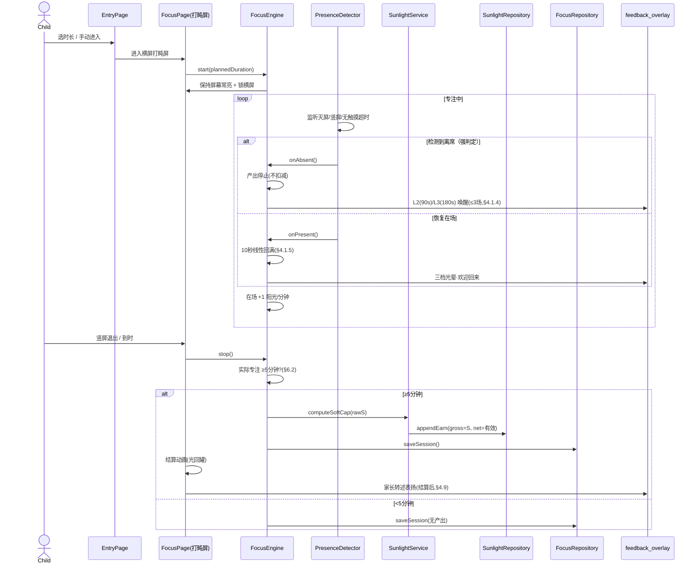
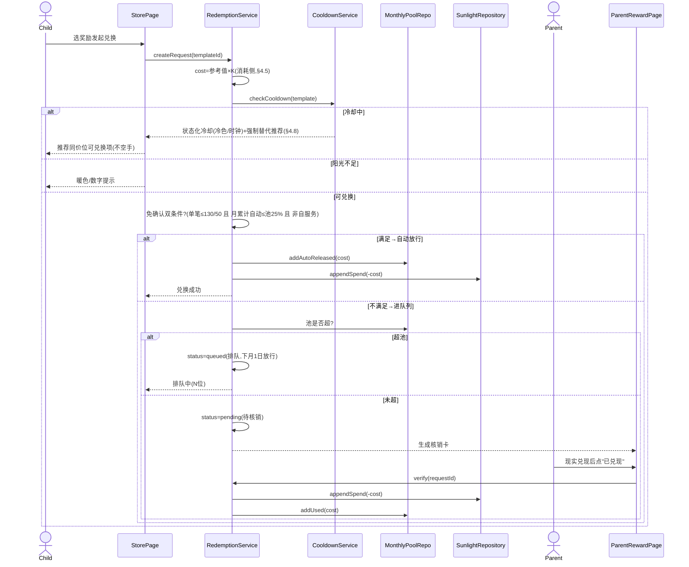
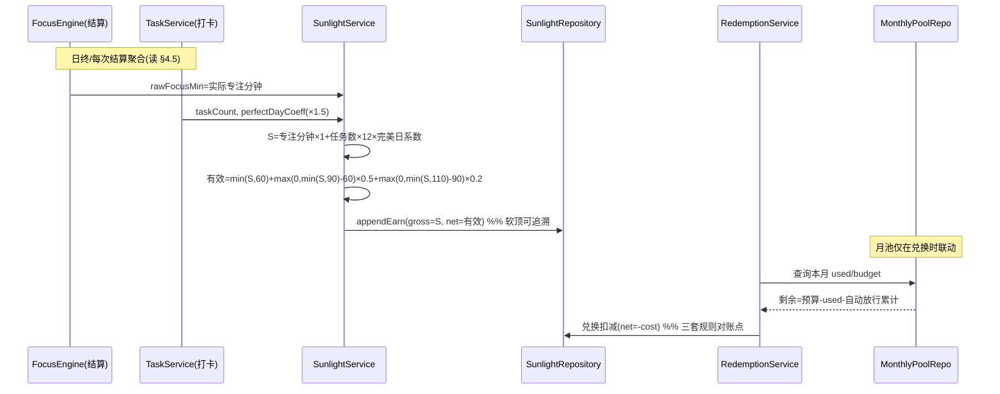

# 《向日葵专注 · SunFocus》MVP 系统架构设计 + 任务分解 + 排期

> 文档角色：开发计划文档（设计产出，不含实现代码）
> 作者：架构师 高见远（Gao）
> 需求来源：**《向日葵专注_PRD_v2.0》**（下称 PRD，本文所有数值一律引用 PRD 参数，不重新硬编码）
> 基线决策（已锁定，不可推翻）：① Plan B 纯本地单机（无账号/家庭组/云同步），但**代码层预留账号+云同步接入点**；② Flutter，MVP 先 Android；③ 兼职 20h/周；④ 本次交付开发计划文档。

---

## 0. 设计纪律（防孪生）

| 纪律 | 落地方式 |
|---|---|
| 数值不孪生 | 所有可调数值集中在 `core/constants/prd_params.dart` 单点定义，**逐条注释对应 PRD 节号**（如 `nightBoundaryDefault → §6.1`、`softCapSegments → §4.5`）。页面/服务只引用常量，禁止字面量。 |
| 夜间边界唯一值 | `Settings.nightBoundary` 是唯一收口值，锁定页/防沉迷设置/可用时段全部读它（PRD §6.1 不变式）。 |
| 产出侧不乘 K | `K` 仅作用于消耗侧定价（§4.5 公式③），阳光产出一律 1/min（§4.1.5）。 |
| 可审核 | 阳光流水 append-only，软顶/月池/排队三套规则全部可追溯对账（见 §3）。 |

---

## 1. 技术选型与理由

### 1.1 选型对比表

| 维度 | 候选 | 选型 | 理由（面向"单人维护 + AI 可读"） |
|---|---|---|---|
| 状态管理 | Provider / **Riverpod** / Bloc / GetX | **Riverpod 2.x** | 显式依赖图、编译期可查、Provider 即 DI；比 Bloc 模板少、比 GetX 可控；AI 易读依赖注入。 |
| 本地结构化存储 | Hive / Isar / **Drift(SQLite)** | **Drift + SQLCipher** | 需**聚合查询 + 时间序列**（专注记录/阳光流水/打卡），关系型胜出；Drift 强类型 DAO、JOIN/SUM/GROUP BY 原生支持；SQLCipher 满足 §10.4 加密存储义务。 |
| 简单 KV 设置 | shared_preferences | **shared_preferences** | 设置项多为单值，KV 比建表轻；与 Drift 分工。 |
| PIN/密钥 | flutter_secure_storage | **flutter_secure_storage** | 家长 PIN 哈希 + salt 存系统安全区（§4.9 / §10.4）。 |
| 动画 | Rive / **Flutter 原生** | **Flutter 原生**（CustomPainter + AnimationController） | 打盹屏是"慢状态"低耗绘制，无需 Rive 运行时；原生可读、改色/改速直接改代码，省美术管线。Rive 列为 V2 可选增强。 |
| 音频 | just_audio / flutter_tts | **just_audio（主） + flutter_tts（备）** | 台词固定 → 预录音频播放最稳、语气可控；TTS 作台词快速迭代备选。均跟随系统静音（§4.1.4）。 |
| 屏幕常亮 | wakelock_plus | **wakelock_plus** | 打盹屏应用层保持唤醒（§4.2 / P6 验证项）。 |
| 物理方向检测 | native_device_orientation | **native_device_orientation** | 检测**真实**设备方向，兼容系统方向锁定/支架场景（§4.1.1 P7）；UI 方向用 `SystemChrome` 锁横屏。 |
| 路由 | go_router | **go_router** | 声明式路由，便于横竖屏页切换与深层链接。 |
| 不可变模型 | freezed | **freezed** | 实体/事件不可变，AI 易推断；减少手写样板。 |
| 时间/区域 | intl | **intl** | 月池重置（每月 1 日 0 点）、夜间边界判断。 |
| ID | uuid | **uuid** | 实体主键。 |
| 本地通知（可选） | flutter_local_notifications | **可选** | 冷却/提醒在 App 后台时兜底；专注为前台可不做，留接口。 |

### 1.2 依赖包清单（以 pub.dev 最新稳定版为准）

```
flutter_riverpod: ^2.5.0        # 状态管理 + DI
drift: ^2.20.0                  # 本地关系型 DB
drift_dev: ^2.20.0              # (dev) 代码生成
sqlite3_flutter_libs: ^0.5.0
sqlcipher_flutter_libs: ^0.5.0  # 加密存储（§10.4 C13）
path_provider: ^2.1.0
shared_preferences: ^2.2.0
flutter_secure_storage: ^9.0.0  # 家长 PIN 哈希
wakelock_plus: ^1.2.0
native_device_orientation: ^2.0.0
just_audio: ^0.9.0
flutter_tts: ^4.0.0             # 备选 TTS
intl: ^0.19.0
freezed: ^2.4.0                 # (dev)
freezed_annotation: ^2.4.0
uuid: ^4.0.0
go_router: ^14.0.0
flutter_local_notifications: ^17.0.0  # 可选
```

### 1.3 屏幕常亮与方向监听实现路径

- **常亮**：`wakelock_plus` 在 `FocusPage` 进入时 `enable()`、退出时 `disable()`；同时 `SystemChrome.setEnabledSystemUIMode` 隐藏导航栏。
- **方向**：监听 `NativeDeviceOrientation` 流判断物理横/竖；进入专注时 `SystemChrome.setPreferredOrientations([landscape])`；竖屏动作（物理竖屏 OR 手动退出）→ 触发暂停+确认（§4.1.6）。
- **降级方案（P6）**：若厂商省电杀常亮，降级为「低亮定时刷新 + 系统级专注模式（Do Not Disturb 类）」；详见 §8。

---

## 2. 分层架构

```mermaid
flowchart TB
    subgraph PL["表现层 Presentation"]
        CP["孩子端 Pages / Widgets"]
        PP["家长端 Pages / Widgets"]
    end
    subgraph DL["领域层 Domain"]
        ENT["Entities（实体）"]
        RI["Repository 接口（抽象）"]
        SVC["领域服务 FocusEngine / Sunlight / Redemption / Cooldown / Metrics ..."]
    end
    subgraph DATA["数据层 Data"]
        RL["Local Repository 实现（Drift DAO）"]
        DB[("Drift + SQLCipher DB")]
        REM["Remote / Sync 占位（G2+ 接入点）"]
        SEC["flutter_secure_storage（PIN）"]
    end
    CP --> SVC
    PP --> SVC
    SVC --> RI
    RI <|.. RL
    RL --> DB
    RL --> SEC
    REM -.未来账号+云同步.-> RI
```

### 2.1 Repository 抽象如何为账号 + 云同步留口

- **领域层只依赖接口**（`FocusRepository` / `SunlightRepository` / `TaskRepository` / `PlantRepository` / `RewardRepository` / `SettingsRepository` / `TrackingRepository`），不感知存储实现。
- **MVP 实现** `Local*Repository`，后端 `Drift` + `shared_preferences`。
- **G2+ 切换点**：新增 `Synced*Repository` 组合「本地 Drift + 远程适配器」，或在 DI（`core/di/providers.dart`）处替换实现；领域服务**零改动**。
- **账号/家庭组占位**：`domain/services/account_service.dart` 留接口桩（`signIn / linkFamily / syncProfile`），MVP 抛 `UnsupportedInPlanB`，未来实现；数据模型已含 `childId` 字段（单孩子 MVP 固定值），避免 V2 多档案重构。

---

## 3. 数据模型

### 3.1 核心表结构（字段类型 + 关键索引）

| 表 | 关键字段（类型） | 索引 / 说明 |
|---|---|---|
| **focus_session** | id(uuid,PK) / start(DateTime) / end(DateTime?) / planned_min(int) / actual_focus_min(double) / status(enum) / sunlight_earned(double) / created_at | idx(start), idx(day_key)；`actual_focus_min` 仅 ≥5 分钟才计（§6.2） |
| **sunlight_ledger** | id / ts(DateTime) / type(enum) / gross(double) / net(double, signed) / balance_after(double) / ref_type / ref_id / day_key | **append-only**；idx(ts), idx(day_key), idx(ref_id)；记账核心，见 §3.2 |
| **task** | id / name / subject / requires_focus(bool) / min_focus_min(int=15) / sunlight_reward(int=12, 5–40) / repeat_rule / is_custom(bool) | 模板 3 内置 + 自定义（§4.4 / §8.2） |
| **check_in** | id / task_id / date / completed_at / session_id(关联≥15min专注) / is_perfect_day(bool) | idx(date), idx(task_id)；完美日=同日同科"专注+打卡"（§4.4） |
| **plant** | id / species_id / pot_index / stage(enum 3段) / stage_started_at / growth_factor(1.0/1.3) / water_used(bool/段) / fertilizer_used(bool/段) / status(enum) / last_water_at | idx(pot_index)；软绑定绝不因专注差而死（§4.6 H2） |
| **plant_species** | id / name / rarity(enum) / base_cost_high / base_cost_low / growth_hours_per_stage | MVP 3 种（§8.2 推迟）；定价读 §4.6 |
| **reward_template** | id / name / category(enum 自服务/家长经手) / base_cost_high / base_cost_low / freq_limit(周/月+次数) / cooldown_rule / enabled | 读 §4.8 定价表 |
| **redemption_request** | id / template_id / requested_at / cost(int,含K) / status(enum) / auto_approved(bool) / queue_position(int?) / verified_at / parent_note | idx(status), idx(requested_at)；核销队列=status∈(pending,queued) |
| **monthly_pool** | month_key / budget(int 400/160,100–1200) / used(int) / auto_released(int) / reset_at | 每月 1 日 0 点重置（§4.8） |
| **cooldown_counter** | template_id / period_key(周/月) / used_count | 频次上限主阀门（§4.8 E6） |
| **settings** | age_tier / night_boundary(TimeOfDay,**唯一值 §6.1**) / daily_focus_cap(60/90) / daily_app_cap(30) / rest_after(2) / rest_min(10) / task_sunlight(12) / monthly_pool_budget / parent_pin_hash / quiet_mode / sound_on / bgm_on / detection_on / auto_confirm_single(130/50) / auto_confirm_month_pct(25) / currency_rate(0.25) / theme / autonomous_mode | 单例行 |
| **tracking_event** | id / type(enum 纪念册/指标) / ts / payload(JSON) | 毕业纪念册埋点 + WFD/履约率/留存指标（§8.3 / §8.4） |

### 3.2 阳光流水如何记账（保证三套规则可追溯、可对账）

设计铁律：**单一 append-only 账本 `sunlight_ledger` + 独立 `monthly_pool` 预算池**。

- **软顶（每日产出上限）**：结算时由 `SunlightService.computeSoftCap(S)` 计算（公式读 §4.5）。账本每条 earn 同时记 `gross=S` 与 `net=有效阳光`，`day_key` 可日聚合，审计可还原"原始 S=162 → 实得 79"。
- **月度池（每月兑换预算）**：`monthly_pool.used` 仅记录**家长显式核销 + 免确认自动放行**的扣减；与账本相互独立但**必须一致**（账本 sunlight ≥ 0，池 used ≤ budget）。
- **排队放行**：超池时 `redemption_request.status=queued`，**不立即扣账本也不扣池**；每月 1 日 0 点 `RedemptionService.releaseQueue()` 按 `requested_at` 升序释放，写入 ledger(`net=-cost`) + 新月份 `used+=cost`。
- **对账 SQL 示例**（DAO 内）：`SELECT SUM(net) FROM sunlight_ledger WHERE day_key=?`（日软顶校验）；`SELECT SUM(net) FROM sunlight_ledger WHERE type='redeem' AND ref_id IN (SELECT id FROM redemption_request WHERE status='verified')`（核销总额对账）。

---

## 4. 关键流程时序图

### 4.1 ① 一次完整专注（横屏进入 → 打盹屏 → 检测离席 → 四档反馈 → 结算）



### 4.2 ② 兑换申请 → 免确认判定 → 家长核销 → 阳光扣除



### 4.3 ③ 软顶与月度池的联合计算



---

## 5. 模块划分与文件目录结构（`lib/`）

```
lib/
├── main.dart                      # 入口
├── app.dart                       # Riverpod ProviderScope + Theme + Router
├── bootstrap.dart                 # 初始化：DB/常亮/月池重置检查/Provider
├── core/
│   ├── constants/
│   │   ├── prd_params.dart        # ★单点引用所有 PRD 数值（防孪生）
│   │   └── app_constants.dart     # 最短5分钟/恢复10秒/L2-L3阈值/声量账上限
│   ├── errors/failures.dart
│   ├── utils/
│   │   ├── datetime_ext.dart      # 月池重置(每月1日0点)/夜间边界判断
│   │   └── math_ext.dart          # 软顶公式/分龄换算
│   └── di/providers.dart          # 全局装配（含 Repository 注入点/未来换云实现）
├── domain/
│   ├── entities/                  # 实体（见 §3.1）
│   │   ├── focus_session.dart  sunlight_entry.dart  task.dart  check_in.dart
│   │   ├── plant.dart  plant_species.dart  reward_template.dart
│   │   ├── redemption_request.dart  monthly_pool.dart  cooldown_counter.dart
│   │   ├── settings.dart  tracking_event.dart  enums.dart
│   ├── repositories/              # 抽象接口（为云同步留口）
│   │   ├── focus_repository.dart  sunlight_repository.dart  task_repository.dart
│   │   ├── plant_repository.dart  reward_repository.dart  settings_repository.dart
│   │   └── tracking_repository.dart
│   └── services/                  # 领域服务（用例）
│       ├── focus_engine.dart          # 计时/在场/产出速率/最短5分钟/恢复10秒
│       ├── presence_detector.dart     # 屏幕交互检测：灭屏/竖屏/无触摸→离席
│       ├── sunlight_service.dart      # 软顶计算 + 记账
│       ├── redemption_service.dart    # 兑换/免确认双条件/月池/排队
│       ├── cooldown_service.dart      # 冷却期状态化/强制替代/双拒绝熔断
│       ├── anti_addiction_service.dart# 防沉迷（读夜间边界单一值）
│       ├── metrics_service.dart       # WFD/履约率/队列充足性/留存
│       ├── praise_service.dart        # 夸夸台转述表扬
│       ├── sunlight_score_service.dart# ★V2 阳光分数化换算接口（桩）
│       └── account_service.dart       # ★账号/家庭组占位桩（Plan B 抛 Unsupported）
├── data/
│   ├── local/
│   │   ├── database/
│   │   │   ├── app_database.dart      # Drift DB 定义（含 SQLCipher opener）
│   │   │   ├── tables.dart            # 所有 Drift 表
│   │   │   └── daos.dart              # 聚合/时间序列查询
│   │   ├── repositories/              # 本地实现（实现 domain 接口）
│   │   │   ├── local_focus_repository.dart ... local_tracking_repository.dart
│   │   └── settings_store.dart        # shared_preferences 封装
│   └── remote/                      # 占位（G2+ 接入点）
│       ├── remote_config.dart        # 接口桩
│       └── sync_adapter.dart         # 本地+远程合并（未来）
├── presentation/
│   ├── child/                      # 孩子端（竖屏）
│   │   ├── pages/
│   │   │   ├── home_page.dart        # 今日状态卡+底部导航
│   │   │   ├── task_page.dart        # 今日打卡列表
│   │   │   ├── garden_page.dart      # 植物园+商店+图鉴 子页签
│   │   │   ├── store_page.dart       # 阳光商店+兑换+冷却/排队/余额
│   │   │   ├── mine_page.dart        # 徽章/设置/家长天地入口
│   │   │   ├── focus_page.dart       # 横屏专注页(打盹屏,不可交互)
│   │   │   ├── settle_page.dart      # 结算动画(光回罐)
│   │   │   ├── rest_page.dart        # 休息/假期态
│   │   │   ├── lock_page.dart        # 向日葵睡觉中(读夜间边界)
│   │   │   └── entry_page.dart       # 专注入口(选时长+音效/锁+手动横屏)
│   │   ├── widgets/
│   │   │   ├── sunflower_canvas.dart  # CustomPainter 向日葵+呼吸动画
│   │   │   ├── status_card.dart  task_card.dart  plant_card.dart
│   │   │   ├── store_list_item.dart  redeem_card.dart
│   │   │   └── feedback_overlay.dart  # 四档反馈呈现
│   │   └── providers/               # 页面级 Riverpod
│   │       ├── focus_provider.dart  garden_provider.dart  store_provider.dart
│   ├── parent/                     # 家长端（本地 PIN 进入）
│   │   ├── pages/
│   │   │   ├── parent_login_page.dart   # 本地 PIN 锁
│   │   │   ├── parent_today_page.dart   # 今日含核销卡
│   │   │   ├── parent_praise_page.dart  # 夸夸台
│   │   │   ├── parent_reward_page.dart   # 奖励配置+核销
│   │   │   └── parent_settings_page.dart # 防沉迷/年龄档/夜间边界
│   │   └── widgets/
│   │       ├── verification_card.dart  praise_composer.dart  pool_indicator.dart
│   └── shared/
│       ├── theme.dart
│       ├── app_router.dart             # 路由(含横竖屏切换)
│       └── orientation_bridge.dart     # 方向监听桥(native_device_orientation+SystemChrome)
└── (tests/)                        # 各服务单测 + 边界用例
```

---

## 6. 任务分解（核心产出）

> 估时按**单人兼职 20h/周、保守**口径；标注「∥」为该任务可与其它任务并行。任务按实现顺序排列。

| ID | 任务名 | 里程碑 | 涉及文件（核心） | 依赖 | 估时(h) | 并行 |
|---|---|---|---|---|---|---|
| T01 | 项目初始化与依赖装配 | M0 | pubspec.yaml / main.dart / app.dart / bootstrap.dart / theme.dart / app_router.dart | — | 8 | |
| T02 | 领域实体与枚举定义 | M0 | domain/entities/* / enums.dart | T01 | 10 | ∥T03/T05 |
| T03 | 本地数据库与 DAO（Drift+SQLCipher） | M0 | data/local/database/* | T01,T02 | 14 | ∥T02/T05 |
| T04 | Repository 接口 + 本地实现 + DI 装配 | M0 | domain/repositories/* / data/local/repositories/* / settings_store.dart / di/providers.dart | T02,T03 | 12 | |
| T05 | PRD 参数单点 + 工具函数 | M0 | core/constants/prd_params.dart / app_constants.dart / datetime_ext.dart / math_ext.dart | T01 | 6 | ∥T02/T03/T04 |
| T06 | 专注引擎 FocusEngine | M1 | domain/services/focus_engine.dart | T04 | 14 | ∥T07/T10 |
| T07 | 在场检测（屏幕交互检测）+ 方向桥 | M1 | domain/services/presence_detector.dart / shared/orientation_bridge.dart | T01 | 10 | ∥T06 |
| T08 | 四档反馈呈现 + 向日葵画布 | M1 | widgets/sunflower_canvas.dart / feedback_overlay.dart | T01 | 14 | ∥T06/T10 |
| T09 | 打盹屏专注页 + 入口页 + 结算动画 | M1 | focus_page.dart / entry_page.dart / settle_page.dart | T06,T07,T08 | 16 | |
| T10 | 阳光记账与软顶 SunlightService | M1 | domain/services/sunlight_service.dart / local_sunlight_repository.dart | T04 | 12 | ∥T06 |
| T11 | 防沉迷服务 + 锁定页/休息页/假期 | M1 | anti_addiction_service.dart / lock_page.dart / rest_page.dart | T04,T05 | 10 | ∥T06 |
| T12 | 奖励模板 + 月度池 + 设置项数据 | M2 | reward_template.dart / monthly_pool.dart / settings / reward_repo | T02,T03,T04 | 12 | ∥T14 |
| T13 | 兑换服务（免确认双条件+月池+排队） | M2 | domain/services/redemption_service.dart | T12,T04 | 16 | |
| T14 | 冷却服务（状态化+替代+熔断） | M2 | cooldown_service.dart / cooldown_counter.dart | T12 | 10 | ∥T13 |
| T15 | 阳光商店页（兑换UI+冷却/排队/余额） | M2 | store_page.dart / store_list_item.dart / redeem_card.dart | T13,T14 | 14 | |
| T16 | 家长端登录(PIN)+今日页(含核销卡) | M2 | parent_login_page.dart / parent_today_page.dart / verification_card.dart | T04,T13 | 12 | ∥T17 |
| T17 | 家长核销 + 奖励配置 + 夸夸台 | M2 | parent_reward_page.dart / parent_praise_page.dart / praise_service.dart / praise_composer.dart / pool_indicator.dart | T13,T16 | 14 | |
| T18 | 语音/音频接入（just_audio + 安静环境档） | M2 | audio 播放封装 + 接入 feedback/settle | T08,T09 | 8 | ∥T12-T17 |
| T19 | 任务打卡模块 | M3 | task.dart / check_in.dart / task_page.dart / task_card.dart / task_repo | T02,T03,T04,T10 | 14 | ∥T20/T22/T23 |
| T20 | 植物养成（3种/3阶段 + 软绑定） | M3 | plant.dart / plant_species.dart / garden_page(植物) / plant_card.dart | T02,T03,T04 | 16 | |
| T21 | 花园页整合（植物园+图鉴+商店子页签） | M3 | garden_page.dart | T15,T20 | 8 | ∥T22/T23/T24 |
| T22 | 家长端设置页（防沉迷/年龄档/夜间边界） | M3 | parent_settings_page.dart | T11,T04 | 10 | |
| T23 | 埋点体系（纪念册+指标）+ 分数化桩 | M3 | tracking_event.dart / tracking_repo / metrics_service.dart / sunlight_score_service.dart | T04 | 12 | |
| T24 | 我的页/徽章/首页状态卡整合/完美日 | M3 | mine_page.dart / status_card.dart / home_page.dart | T11,T19,T20 | 12 | |
| T25 | 合规落地 G0（隐私规则/同意流/商店表述/降级通道/加密确认） | M4 | 隐私文案 + 同意流 UI + §10.5 改写 | 全 | 12 | ∥T26/T27 |
| T26 | 动画与视觉打磨 + 低端机性能调优 | M4 | sunflower_canvas / settle_page / theme 双套 | T08,T09 | 14 | |
| T27 | 自测 + 集成联调 + 边界用例 | M4 | tests/*（最短5分钟/免确认/排队/冷却/夜间边界） | 全 | 16 | |
| T28 | 上架准备（商店素材/描述去游戏化/Android 配置） | M4 | 商店列表素材 + android 配置 | T25 | 10 | |

**并行说明**：M0 内 T02/T03/T05 可并行；M1 内 T06/T07/T08/T10/T11 多可并行，仅 T09 依赖前三者汇流；M2/M3 同阶段任务大量可并行，是压缩墙钟工期的关键。

---

## 7. 里程碑与排期（20h/周）

| 里程碑 | 范围（对应 PRD） | 任务 | 周数 | 累计工时 | 验证窗口 |
|---|---|---|---|---|---|
| **M0 骨架** | 工程脚手架/DB/Repository/参数单点 | T01–T05 | 2.5 周 | 50h | — |
| **M1 专注闭环** | 打盹屏+计时+四档+结算+软顶+防沉迷骨架（可跑通做 G1 影子测试） | T06–T11 | 4 周 | 76h | **G1 形态**（W4–6，10 户 7 天影子测试，插在 M1 后） |
| **M2 经济与商店核销**（承重墙） | 奖励/月池/免确认/排队/冷却/商店/家长核销/夸夸台 | T12–T18 | 4.5 周 | 86h | **G2 核心循环主门**（W11 起 10 周验证，与 M3/M4 并行） |
| **M3 花园/任务/家长端补齐** | 任务打卡/植物/花园/家长设置/埋点/首页 | T19–T24 | 4 周 | 72h | （并行 G2 验证期） |
| **M4 打磨与上架** | 合规 G0/性能/联调/上架 | T25–T28 | 3 周 | 52h | G0 门（W1–2 起跑，M4 收口） |

- **构建期合计**：约 **18 周 / 336h**（兼职 20h/周，含并行节省）。
- **G1 窗口**：M1 可跑通即插（W4–6，2–3 周影子测试，零成本）。
- **G2 窗口**：M2 完成（≈W11）起 **10 周**验证（W11–21），期间 M3/M4 并行推进——这是 PRD「开发 4–8 周 → 验证 10 周」的落地。
- **G3/G4**：构建期后（W18+）按 §8.1 进行经济留存与商业化验证，不在本 MVP 构建排期内。

---

## 8. 技术风险与待验证项

| 风险 | 等级 | 影响 | 缓解 / 验证 |
|---|---|---|---|
| **P6 屏幕常亮代价** | 高 | 耗电 + 与厂商省电策略冲突，可能触发系统杀常亮 | G1 验证；降级：低亮定时刷新 / 系统级专注模式 / `FLAG_KEEP_SCREEN_ON`；必要时「灭屏即暂停重算」（需用户拍板，见 §9 Q1） |
| **屏幕交互检测误判边界** | 中 | 支架无触摸→误判离席；灭屏但人在→误判离席 | 多信号融合（触摸+方向+亮屏状态）；阈值可配；「离席」仅作强判定，误报由话术兜底（§4.3） |
| **Android 各厂商省电杀后台** | 高 | 国内 ROM（华为/小米/OPPO/vivo）限制后台计时与常亮，专注中断 | 专注为前台交互，计时用 `Stopwatch`+持久化 `start_time`，切回重算；评估是否需前台服务（Foreground Service）维持灭屏计时——**待用户拍板**（§9 Q1） |
| **低端旧机动画性能** | 中 | 目标设备=家庭闲置旧机，打盹屏卡顿 | CustomPainter 轻量绘制 + 限制重绘区；避免 Opacity/Clip 滥用；M4 专项性能调优 + 真机测 Android Go/低端 |
| **加密存储落地成本** | 低 | SQLCipher 增加包体与初始化复杂度 | drift + sqlcipher_flutter_libs 标准 opener；满足 §10.4 C13 |
| **月池重置/排队跨月一致性** | 中 | App 长期不打开导致重置滞后 | 启动即按 `datetime_ext` 计算应重置次数并补跑 `releaseQueue()` |

---

## 9. 待明确事项（需用户拍板）

1. **后台计时与常亮策略（最优先）**：专注中灭屏后，是（A）用前台服务维持计时+常亮（体验完整、耗电/商店审核风险高），还是（B）灭屏即暂停、亮屏重算（省电、但打断"瞟一眼"体验）？此决策直接决定 P6 与国内 ROM 杀后台的应对架构，请在 M0 前拍板。
2. **首发设备形态**：决策②已定 Android 先，但具体是**手机横屏**还是**平板**（PRD §9.2 开放问题1，G1 顺带测）？影响布局断点与方向逻辑，建议 G1 一起验证。
3. **家长端鉴权形态**：Plan B 形态下家长端用**本地 PIN 锁**（与"无账号/无云"一致），**不接短信验证码**（PRD §4.9 原写手机号验证码属账号体系，与 Plan B 冲突）。请确认家长端就是本地 PIN，避免代码层误接云账号。

---

> 附：`docs/sequence-diagram.mermaid`（§4 三张时序图）、`docs/class-diagram.mermaid`（§2/§3 类图与 Repository 抽象）与本文件同源，供工程师直接引用。
