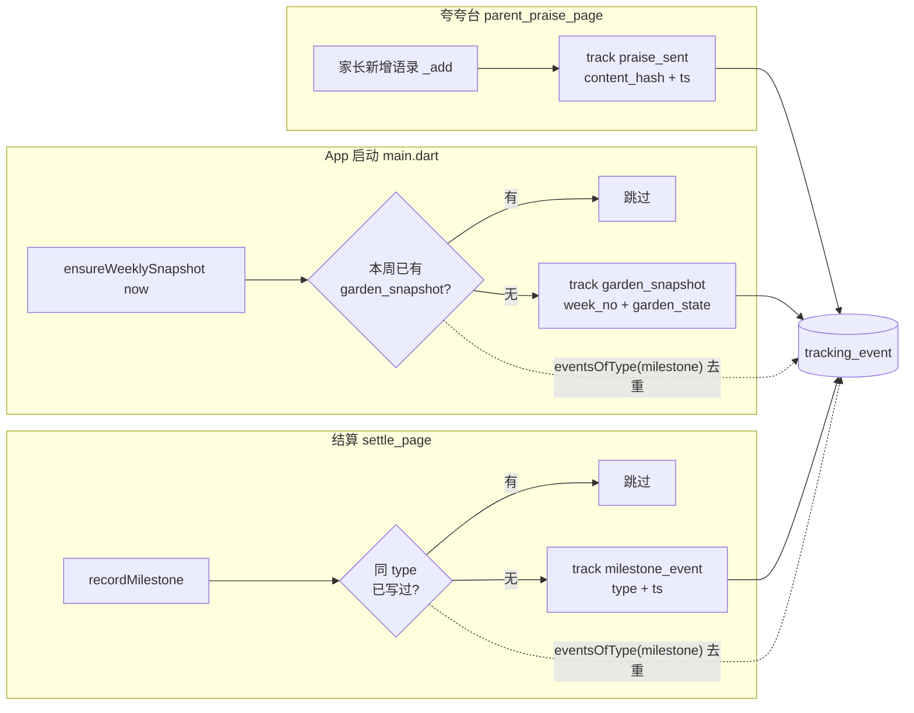
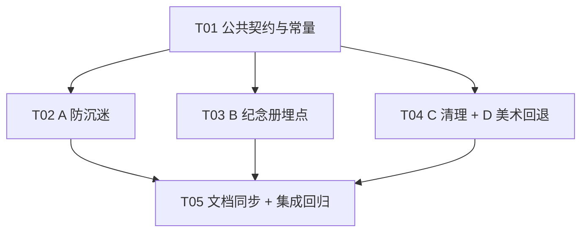

# 系统设计 · P0 缺口补全（A 防沉迷总时长 / B 纪念册埋点 / C 清理调试代码 / D 美术种子期通用回退）

> 作者：Bob（架构师）｜日期：2026-09-23 晚｜基线：`main` @ `bb135e0`（工作区干净，schemaVersion=8）
> 口径依据：`docs/口径裁定表_v1.md`（C1–C13，最高优先级）+ 玄参大人 2026-09-23 晚对 A 的两条拍板 + `docs/验证计划_SunFocus_G0G2.md` §3.2 埋点事件表
> 本文只做**架构设计 + 任务分解**，不含方法体。所有结论均带 `文件:行号` 出处（实地勘察，非文档转述）。
> **本批交付实测（见 §9）**：`flutter analyze` 0 error；全量 **446 测试全绿**；QA 变异 17 点 / 15 有效打红 / 无严重假绿。

---

## 0. 结论速览（先看这段）

| 项 | 核心取舍 | 一句话结论 |
|---|---|---|
| **A 防沉迷** | ① 计时只在**娱乐 tab**（花园/商店/我的）前台累加；② **持久化走 SharedPreferences**（不升 schemaVersion）；③ 计时用**「记录基准 + 差值」幂等纯函数**；④ 服务层**新建独立方法** `isAppCapReached`，**不动** `AntiAddictionDecision` 枚举 | 拦截落点在 `ChildShellPage.onDestinationSelected`；「开始专注」链路零改动、永远可用 |
| **B 埋点** | `TrackingRepository` 接口**一个方法都不扩**（扩了会打破 2 个手写 fake）；去重靠 `eventsOfType(milestone)` + 内存过滤 | 新建 `MemoirService`，3 个事件在既有链路就近接入；`garden_snapshot` 惰性补写、`milestone_event` 按 type 去重 |
| **C 清理** | 删 DEBUG 按钮 + `/s1-demo` 路由 + 页面；**无测试依赖**（已 grep 证实） | 纯删 + 3 个文件的 import 收敛；连带文档加横幅/回写 |
| **D 美术回退** | `forPlant` 候选从 3 级扩到 **5 级**（物种三级 + 通用两级），顺序**物种恒在通用之前** | 已交付的 `species_sunflower_seed*.png` 行为**零变化**（物种级优先命中）；`resolve()` 签名**不改**；护栏测试改 3 条、增若干条 |

**一句话风险总览**：A 的定时器必须**在 dispose 取消**（否则 `nav_structure_test` 的 `pumpAndSettle` 会因 pending timer 断言变红，`binding.dart:2542`）；B 的埋点**不得扩 `TrackingRepository`**（否则 `tracking_test.dart` / `nav_structure_test.dart` 的 fake 编译失败）。

**本批已实测收敛**（2026-09-23，详见 §9）：446 测试全绿 / `flutter analyze` 0 error；QA 变异 17 点 15 有效打红、无严重假绿；已知遗留 = `capMinutes<=0` 无守卫（P2）。

---

## 1. 实现方案（技术选型 + 排除方案）

### A. App 总时长防沉迷

#### A-1 现状（实地勘察）
- `lib/domain/services/anti_addiction_service.dart:62` 是 TODO；`evaluate()` 的 `appUsageMinutes`（`:60`）**无任何调用方传值**（全仓仅 `entry_page.dart:129` 调 `evaluate`，未传该参数）。
- 设置项链路**已通**：`AppSettings.dailyAppCapMinutes`（`settings.dart:10`）← `settings` 表 `daily_app_cap_minutes` 列（`tables.dart:16`）← 家长端可调（`parent_settings_page.dart:224-229`，档位 `[20,30,45]`）。**唯一缺陷是「没人消费它」** → 死设置。
- 儿童端外壳 `ChildShellPage`（`child_shell_page.dart`）5 tab = 今日/成长/花园/商店/我的；用 `IndexedStack` 保活（`:230-237`），切 tab **不重建**、`initState` 只跑一次（`:59-63`）。
- 娱乐页 = 花园(2)/商店(3)/我的(4)；专注入口在**今日页**（`child_today_page.dart:120 → context.go('/entry')`）。

#### A-2 计时口径（**已拍板定案**，见 §8-1）
**采纳口径**：**只统计娱乐 tab（花园 / 商店 / 我的）的前台停留秒数**；今日 / 成长 **不累加**；专注流程（`/entry`·`/focus`·`/rest`，均为**独立路由**，进入即销毁外壳）**不计入**；App 切后台（`paused`/`inactive`/`hidden`）**暂停**；进程被杀 = 暂停（精度损失 ≤ 1 个 tick）。
- 定案值：`kAppUsageCountingTabs = <int>{2, 3, 4}`（花园/商店/我的），**今日(0)/成长(1) 不计入**。
- 理由：口径原文「孩子在商店/花园/我的等非专注页面停留的时间才累加」；缺陷描述亦聚焦「闲逛（商店/花园/夸夸台）」。今日是「出发点」、成长是「正向打卡」，计入会与「成长页保持可用」「学习时间不限」相冲突。

#### A-3 计时器实现（⚠️ 项目已踩坑点）
口径：**「记录基准 + 差值」的幂等纯函数**，每次结算**无条件把基准推进到 `now`**（对齐 `MEMORY.md` 的「时间推进类逻辑」硬规则与 `_advanceGrowth` 事故）。
- 纯函数 `AppUsageService.advance(...)`：输入 `(storedDate, storedSeconds, baseAt, now)`，输出 `(date, seconds, baseAt=now)`。
- 幂等保证：返回值 `baseAt` **恒等于 `now`**。同一 `now` 调两次 → 第二次增量 0；`now` 递增 → 增量 = 真实时间差。**杜绝「刷新越多次涨越快」**。
- 跨天：`dayKey(now) != storedDate` → 归零重算，只计 `[max(baseAt, 当日0点), now]` 秒数（丢午夜前残段，**绝不超额**）。
- **驱动**：外壳内 `Timer.periodic(kAppUsageTickSeconds)`（=5s）→ 每次 tick 调 `advance` → 写回持久化 → 更新 provider（用于拦截判定）。
- **排除方案**：❌「纯记录起点、读取时用 `now-start` 算」——进程被杀后无起点、无法跨重启；❌「只在切 tab 时结算」——孩子一直停在商店页不会触发，等于没限；❌「全局 WallClock 累加器不推进基准」——正是 `_advanceGrowth` 的翻车模式。

#### A-4 持久化方案（推荐 SharedPreferences，**不升 schemaVersion**）
| 方案 | 优 | 劣 | 结论 |
|---|---|---|---|
| **① SharedPreferences（新增 2 个 key）** | 零迁移、零 build_runner、零 schema 变更；`nav_structure_test` 已 mock prefs → **测试零改动**；`DataManagementService.clearAll()` 已 `prefs.clear()` 顺带覆盖删除权（`data_management_service.dart:36`） | 不走 SQLCipher 加密 | ✅ **推荐** |
| ② `settings` 表加 2 列（8→9） | 落加密库 | 升 schema + 迁移测试 + 重生成 g.dart；**且 `saveSettings` 整行覆盖**（`settings_local_repository.dart:58-84`）→ 家长改任一设置都会把 `AppSettings`（不含 usage）覆盖掉 usage 列 → **usage 被清空的隐蔽 bug** | ❌ 排除（有 clobber 雷） |
| ③ 新建 `app_usage` 表（8→9） | 领域干净、加密 | 升 schema + 迁移测试 + 重生成 + 新 DAO/仓储 + `deleteEverything` 增表；`nav_structure_test` 需新增 override（否则打到真 DB） | ⚠️ 备选（若玄参要求加密落库，**选③而非②**） |

> 与合规的兼容：`验证计划 §1.5` 要求加密的是「昵称/年龄档/**专注记录**」；App 浏览时长不属于该列，走 prefs 可辩护。且 `clearAll` 已即时清除，删除权闭环。

#### A-5 服务层契约（**独立方法，不动枚举**）
- 新增 `AntiAddictionService.isAppCapReached(AppSettings s, int appUsageSeconds) -> bool`（纯函数）。
- **不扩 `AntiAddictionDecision` 枚举**，理由（三条）：
  1. **语义相反**：`dailyCapReached` 拦「开始专注」，App 时长放「开始专注」、拦「娱乐页」。塞进同一枚举 → 后续开发者极易把它接进 `entry_page.dart` 的 `evaluate` switch（`entry_page.dart:137-165`），从而**把专注也挡掉**——正是口径明令禁止的。
  2. **连带**：Dart 3 枚举 `switch` 穷尽检查 → 加枚举值会让 `entry_page.dart:137` 的 `switch` 变**非穷尽编译错误**，必须连带改入口页（属「给关键接口扩语义」，违反项目「优先独立方法」纪律）。
  3. **既有测试影响**：`anti_addiction_test.dart` / `anti_addiction_edge_test.dart` **只断言 4 个枚举值、不遍历 `values`** → 扩枚举**不会直接**让这两个文件变红；真正的破坏面是 `entry_page`。综合：独立方法收益最大、连带最小。
- 顺带把 `:62` 的 TODO 注释改写为指向新方法（不再提 `appCapReached` 返回值）。

#### A-6 拦截落点
- **主落点**：`ChildShellPage` 的 `NavigationBar.onDestinationSelected`（`child_shell_page.dart:240`）。目标 tab ∈ 娱乐集合 且 `reached` → **不改 `_index`**，弹**温和提示**（说明具体原因 + 引导去今日专注）。
- **分因提示**：本场景**唯一因**是「App 总时长到顶」；文案明示原因与剩余路径（「今天逛 App 的时间用完啦（上限 N 分钟），去「今日」开始专注吧 🌻」），与夜间锁定（走 `/lock` 页）等其它拦截**天然不同文案**。不设「一律同一句」。
- **永不挡专注**：今日 tab(0) 与其上的「开始专注」按钮、成长 tab(1)、`/entry`·`/focus`·`/rest` 全链路**零改动、永远可用**（`entry_page._start` 不接 App-cap）。此硬口径已被 QA 变异测试锁住（见 §6 / §9）。
- **深链兜底（可选 P2）**：`/garden`、`/store` 独立路由——**已 grep 证实全仓无 `go('/garden')`/`push('/store')` 调用**（唯一深链是 `/parent`，`child_shell_page.dart:226`），故当前**无需**额外守卫；若担心将来接入，可在两个 route builder 加同一守卫。
- **视觉**：娱乐 tab **保持可点**（点了给引导），默认不做「灰化」（避免儿童看到 3 个「死 tab」的挫败感）；若玄参要「锁感」，再加锁角标（P2）。

#### A-7 领域层纪律
- 纯函数 `app_usage_service.dart` **只 import `dart:core` + `datetime_ext.dart`**（flutter-free，可 `package:test` 直接单测）。
- 进程级无单例（控制器随 `ProviderScope` 生命周期）→ **无需 `resetForTest()`**；纯函数无状态。
- **异常防御分级（已按「可测行为」定案，见 §9）——不再自相矛盾**：
  - **时钟回拨**（`now < baseAt`，成因：用户改系统时间 / 系统对时 / 夏令时）是**环境输入、不是程序员违约** → **不抛异常**：增量记 0，且**仍无条件把基准推进到 `now`**（避免负增长；若每 5s tick 抛异常会直接让 App 不可用）。
  - **`StateError` 用于真正的不变量破坏**：`storedSeconds < 0` → 抛 `StateError`（release 会剥离 assert，故用 `StateError` 而非 `assert`）。
  - **已知未防御项（P2 遗留）**：`capMinutes <= 0` 无守卫 —— 若设置被写坏为 0，会让娱乐页**立即锁死**；取值受 `kDailyAppCapOptions=[20,30,45]` 约束，风险低，标注为 P2。
- **判定单点（防孪生）**：`seconds >= cap * 60` 的判定**只允许存在一处** —— 口径真源为服务层 `AntiAddictionService.isAppCapReached`（吃 `AppSettings`）；纯函数如暴露 `isCapReached` 只作**委托**，**不得**再各写一份比较分支（本批曾出现判定孪生，已修复，见 §9）。

### B. 纪念册埋点（3 个事件上线）

#### B-1 现状（实地勘察）
- `tracking_event` 表已建（`tables.dart:187`）、`TrackingEventNames` 已有 10 常量（`tracking_event_names.dart`）、`TrackingRepository` 已存在（`tracking_repository.dart`）、`TrackingLocalRepository` 已真实落库（`tracking_local_repository.dart`）。
- **已真实埋点 4 类事件**：`focus_session_start/end`（`focus_page.dart:403/420`）、`sun_earned`/`valid_focus_day`（`settle_page.dart:119/141`）、`reward_*`（`redemption_orchestration_service.dart`）、`weekly_pool_reset`（`weekly_pool_service.dart:49`）、`parent_dau`（`parent_login_page.dart:44`）。
- 3 个目标事件**全仓 0 命中**：`garden_snapshot` / `milestone_event` / `praise_sent`。
- 夸夸台 = `ParentPraisePage`（`parent_praise_page.dart`），语录存 SharedPreferences（key `praise_notes_v1`，`:17`）；**无「送达给孩子」链路**（结算页仅占位 `settle_page.dart:337/475`）。
- `TrackingType` 枚举只有 `milestone` / `metric`（`enums.dart:111-114`）。纪念册原料 → 用 `milestone`。

#### B-2 关键约束：**不扩 `TrackingRepository` 接口**
- 接口只有 3 个方法（`tracking_repository.dart`）。**任何新增都会打破手写 fake**：`test/m2/tracking_test.dart:12`、`test/nav/nav_structure_test.dart:150`（两处 `implements TrackingRepository`）→ 编译失败，违反「不回归」。→ **零接口变更**。
- **去重策略（不查库也能去重）**：用现成的 `eventsOfType(TrackingType.milestone)` 取回纪念册事件列表，**内存过滤** `name == 'garden_snapshot' && payload['week_no'] == 本周键` / `name=='milestone_event' && payload['type'] == X`。一年量级（≈52×几条）内存过滤无压力。

#### B-3 新增服务 `MemoirService`（`lib/domain/services/`，flutter-free）
- `ensureWeeklySnapshot(now)`：**惰性补写**。调用点 = `main.dart` 启动序列（与 `releaseQueue`/种子同款 `unawaited` 模式，`main.dart:49-59`）+ 可选 `ChildShellPage` 首帧。**幂等**：本周已写则跳过。**跨周未开的周不补**（不伪造错标数据，见 §8-3）。
- `recordMilestone(type, now)`：**按 type 去重，一生只写一次**（遍历 `eventsOfType(milestone)` 判同 type）。
- `recordPraiseSent(content, now)`：写 `praise_sent`（payload `content_hash` = `sha256(utf8(content))` hex，`crypto` 已是依赖 `pubspec.yaml`「crypto: ^3.0.3」；`ts` = ISO 串，沿用 `parent_login_page` 的 `'ts': now.toIso8601String()` 写法）。
- `garden_state` 取值：`jsonEncode(List<Map>` 的紧凑花园摘要（`[{id,species,stage,status,progress}]`）。

#### B-4 接入点
| 事件 | 接入点（文件:行号） | 说明 |
|---|---|---|
| `praise_sent` | `parent_praise_page.dart` `_add()` 持久化成功后（`:83` 附近） | **已拍板**：emit 点 = 「家长在夸夸台**新增语录成功**」（当前无孩子端送达链路，以此为代理）；若后续补「结算后送达」，emit 点迁到送达处（见 §8-2） |
| `garden_snapshot` | `main.dart` 启动 `unawaited`（`:59` 后） | 惰性、每周一次、幂等 |
| `milestone_event` | `settle_page.dart` `initState`（`:100-105` 现有埋点段） | 结算后按累计统计判「新跨过的里程碑」；按 type 去重 |

#### B-5 里程碑类型（**已拍板：4 类**）
据 App **已有**统计（`FocusRepository.totalStats()` → `FocusStats`，`focus_repository.dart:11`）取 4 类，收敛为常量：
- `first_valid_focus_day`（首个有效专注日）
- `focus_total_600min`（累计专注满 600 分钟）
- `valid_days_30`（累计有效专注日满 30 天）
- `first_bloom`（首株开花）
> 实现上用常量列表 + 判定函数；后续增删类型零结构改动。

### C. 清理调试代码

- `child_profile_page.dart`：删 `_grantDebugSunlight`（`:74-98`）、`调试区` 段（`:182-189`）；收敛随之失效的 import。
- `app_router.dart`：删 `/s1-demo` 路由（`:73-76`）+ `s1_demo_page` import（`:18`）。
- 删 `lib/presentation/child/pages/s1_demo_page.dart`（其依赖的 `SunflowerCanvas`/`FeedbackOverlay` **仍被 `focus_page`/`settle_page` 使用**，不受影响）。
- **引用关系已 grep 证实**：`lib/` 内只有 `app_router.dart` 引用 `s1_demo_page`；`test/` 内**无任何** `S1DemoPage`/`s1-demo` 引用；`main.dart:3` 仅注释提及。
- **排除方案**：❌ 保留 `/s1-demo`——spike 演示页无 UI 入口、上架前应清；❌ 把 DEBUG 按钮改为 `kDebugMode` 包裹——源码已明标「提交前删除」，release 仍会带该文案与逻辑，不如整段删。

### D. 美术 · 种子期通用回退级

#### D-1 现状契约
`PlantArtCandidates.forPlant`（`plant_artwork.dart:53-62`）三级：`species_{stage}_{status}` → `species_{stage}` → `species` → 自绘占位。`resolve`（`:65-79`）按序命中。

#### D-2 目标：新增「通用」一级
**新候选顺序（5 级）**：
```
① species_{stage}_{status}   物种最精确
② species_{stage}            物种该阶段
③ species                    物种通用
④ shared_{stage}_{status}    ← 新增：通用该阶段·该状态
⑤ shared_{stage}             ← 新增：通用该阶段
⑥ 全不中 → 自绘占位（PlantPlaceholderArt）
```
- **物种级恒在通用级之前** → 已交付的 `species_sunflower_seed.png` 等**行为零变化**（这正是「不许破坏已有资源」的落点）。
- **`resolve()` 签名不改**（仍 `resolve(Set<String> assets, {speciesId, stage, status})`）；只改内部遍历的候选列表来源。
- 「种子期通用」实战取值：`shared_seed.png`（growing 用）+ `shared_seed_wilting.png`（wilting 用）；**仙人掌**因 `seed_dead` 可达（美术清单 §3.2）**保留** `species_cactus_seed_dead.png`（通用级不提供 dead 种子）。

#### D-3 护栏测试影响（`test/m3/plant_art_resolve_test.dart`，共 12 条）
| 用例 | 是否受影响 | 原因 / 处置 |
|---|---|---|
| A1 `forPlant` 恰好 3 条 | **受影响** | 变 5 条 → 断言补 `shared_seed_*`/`shared_shared` 两条（更新为 5 元素有序列表） |
| A2 三者都在命中「最精确」 | 不受影响 | 物种级仍最先 |
| A3 回退「物种_阶段」 | 不受影响 | 物种级在通用前 |
| A4 回退「物种」 | 不受影响 | — |
| A5 全空 → null | 不受影响 | 通用级也为空 |
| A6 相邻物种不串味（every contains species_daisy） | **受影响** | 通用级不含 `species_daisy` → 改为「**前 3 条**必含本物种、后 2 条为 `shared_`」 |
| B1/B2 枚举名 | 不受影响 | — |
| B3 `hasLength(3)` + 索引 | **受影响** | 改 `hasLength(5)` + 索引 0..4 |
| C1/C2 清单链路 | 不受影响 | — |
| D1 无资源回退占位 | 不受影响 | — |

→ **3 条需改（A1/A6/B3），9 条不动**；另**新增**：④命中 shared_stage_status、⑤命中 shared_stage、⑥物种命中优先于通用（order guard）。

#### D-4 美术清单文档要改什么（`docs/美术资源清单_花园植物.md`）
- §1 命名契约：三级 → 五级（补 shared 两行）。
- §4 出图数量**重算**（原 28 → **24**，省 4 张）：
  | 物种 | 原设计槽位 | 通用后所需物种图 | 说明 |
  |---|---|---|---|
  | 向日葵 | 9 | 7（sprout×3 + adult×4） | 种子两态改走通用；已交付的 3 张 seed 图**保留不删**（物种级优先，行为不变） |
  | 小雏菊 | 9 | **7**（省 `seed`/`seed_wilting`） | 待出 |
  | 仙人掌 | 10 | **8**（省 `seed`/`seed_wilting`，**保留 `seed_dead`**） | 待出 |
  | **通用** | — | **+2**（`shared_seed`、`shared_seed_wilting`） | 新增 |
  | **合计** | **28** | **24** | **净省 4** |
  - **待出（未交付）**：原 `雏菊9+仙人掌10`；现 `通用2 + 雏菊7 + 仙人掌8 = 17`。
  - ⚠️ 现存文档内部不一致需一并修：进度表 §4 写「0/19」、美术清单 §4.4 汇总写「待出 18」而逐条列 9+10 → 本次出图一并**对齐为 17**。
- §3.2/§3.4 补一句：种子期健康/枯萎由通用图覆盖，普通物种**不再出种子图**。

#### D-5 第四级兜底图？（评估，建议**不做**）
- 候选：「所有物种所有阶段共用的兜底图」（如 `assets/plants/shared.png`）。
- **建议不做**：最终兜底已是**阶段/物种感知的自绘占位**（`PlantPlaceholderArt`，会按 seed/sprout/adult 与枯萎/死亡变色）；换成一张「全局通用图」反而会**把种子画成成株**，视觉更错。若要「永不出现占位」，代价与收益不匹配。
- 若玄参坚持：可在 ⑤ 之后加 `shared.png`（第六级），但**默认不纳入本次范围**。

---

## 2. 文件清单

### 新增（8）
| 文件 | 说明 |
|---|---|
| `lib/domain/services/app_usage_service.dart` | A：App 时长计时**纯函数**（`advance` / `isCapReached`）+ `AppUsageTick` 值对象；flutter-free |
| `lib/presentation/child/state/app_usage_controller.dart` | A：Riverpod 控制器（读/写 prefs、`Timer.periodic` 驱动、`startCounting/stopCounting`、`AppUsageState`） |
| `lib/domain/services/memoir_service.dart` | B：纪念册服务（`ensureWeeklySnapshot` / `recordMilestone` / `recordPraiseSent`） |
| `test/m4/app_usage_service_test.dart` | A：纯函数幂等/跨天/边界/时钟回拨测试 |
| `test/m4/child_shell_app_cap_test.dart` | A：外壳拦截 widget 测试（到顶锁娱乐 tab、放行今日/成长） |
| `test/m3/memoir_service_test.dart` | B：快照去重/跨周/里程碑去重/字段名 |
| `docs/P0缺口_class-diagram.mermaid` | 本次类图（避免覆盖项目级 `docs/class-diagram.mermaid`） |
| `docs/P0缺口_sequence-diagram.mermaid` | 本次时序图（避免覆盖项目级 `docs/sequence-diagram.mermaid`） |

### 修改（13）
| 文件 | 改动 |
|---|---|
| `lib/core/constants/app_constants.dart` | +`kAppUsageTickSeconds`(=5)、`kAppUsageCountingTabs`(`{2,3,4}`)、prefs key `kPrefAppUsageDate`/`kPrefAppUsageSeconds`、`kDailyAppCapOptions=[20,30,45]`（收口孤儿字面量）；复用已存在但闲置的 `kDailyAppCapMinutes`（`app_constants.dart:19`） |
| `lib/core/constants/tracking_event_names.dart` | +`praiseSent`/`gardenSnapshot`/`milestoneEvent` 3 常量 |
| `lib/core/constants/prd_params.dart` | +里程碑阈值常量（`kMilestone*`）；App-cap 单位换算常量（如需） |
| `lib/domain/services/anti_addiction_service.dart` | +`isAppCapReached(s, appUsageSeconds)`（**App-cap 判定唯一真源**）；改写 `:62` TODO 注释（不扩枚举） |
| `lib/data/local/settings_store.dart` | +`appUsageDate()`/`appUsageSeconds()`/`saveAppUsage({date,seconds})` |
| `lib/core/di/providers.dart` | +`appUsageControllerProvider`、+`memoirServiceProvider` |
| `lib/presentation/child/pages/child_shell_page.dart` | 实现 `WidgetsBindingObserver`；`onDestinationSelected` 拦截；计时启停；`dispose` 取消定时器 |
| `lib/presentation/parent/pages/parent_settings_page.dart` | App 时长档位 `[20,30,45]` 字面量 → `kDailyAppCapOptions`（顺带收口） |
| `lib/presentation/parent/pages/parent_praise_page.dart` | `_add()` 成功后 emit `praise_sent` |
| `lib/presentation/child/pages/settle_page.dart` | `initState` 埋点段后调 `memoirService.recordMilestone(...)`（判新跨过里程碑） |
| `lib/main.dart` | 启动序列 +`ensureWeeklySnapshot` 惰性调用；修正 `:3` 注释里的 `/s1-demo` 表述 |
| `lib/presentation/child/pages/child_profile_page.dart` | 删 DEBUG 按钮与相关 import |
| `lib/shared/app_router.dart` | 删 `/s1-demo` 路由 + import |
| `lib/presentation/child/widgets/plant_artwork.dart` | `forPlant` 三级 → 五级；更新顶部契约注释 |
| `test/m3/plant_art_resolve_test.dart` | 改 A1/A6/B3；+shared 3 用例 |
| `test/m2/tracking_test.dart` | +3 事件名与 payload key 断言 |
| `docs/美术资源清单_花园植物.md` | §1 契约、§4 重算（28→24 / 待出 17） |
| `docs/口径裁定表_v1.md` | +**C14**（A 防沉迷口径）+ 变更记录 |
| 其余文档 | 见 §7 文档矩阵 |

### 删除（1）
| 文件 | 说明 |
|---|---|
| `lib/presentation/child/pages/s1_demo_page.dart` | spike 演示页，无引用（grep 证实） |

---

## 3. 数据与接口（Dart 签名，无方法体）

### A · 领域纯函数
```dart
// lib/domain/services/app_usage_service.dart
/// 一次结算的返回（baseAt 恒等于调用时的 now —— 无条件推进）。
class AppUsageTick {
  final String date;      // 累计所属日 key（yyyy-MM-dd）
  final int seconds;      // 该日累计秒（封底 0）
  final DateTime baseAt;  // 已推进到 now
  const AppUsageTick({required this.date, required this.seconds, required this.baseAt});
}

class AppUsageService {
  AppUsageService._();

  /// 把 [baseAt, now] 内属于「now 所在自然日」的秒数累加到 [storedSeconds]。
  /// 幂等：返回值 baseAt 恒 = now；now 相同则增量 0。跨天 → 归零重算（只计当日部分）。
  /// 时钟回拨（now < baseAt，环境输入）→ 增量取 0，**仍推进基准、不抛异常**。
  /// 不变量破坏（storedSeconds < 0）→ 抛 StateError。
  static AppUsageTick advance({
    required String storedDate,
    required int storedSeconds,
    required DateTime baseAt,
    required DateTime now,
  });

  /// 是否已达当日 App 总时长上限（§6.1）。纯判定，不参与「开始专注」。
  /// ⚠️ 判定单点：口径真源为 [AntiAddictionService.isAppCapReached]；本方法如保留仅作**委托**，
  ///    **不得**再各写一份 `seconds >= cap*60` 比较（防「判定孪生」，见 §9）。
  static bool isCapReached({required int capMinutes, required int secondsToday});
}
```

### A · 服务层（独立方法 · App-cap 判定唯一真源）
```dart
// lib/domain/services/anti_addiction_service.dart （新增方法，不动枚举）
  /// App 总使用时长是否达上限（仅用于娱乐页准入；**绝不**参与 evaluate 的专注准入）。
  /// 判定单点：`seconds >= dailyAppCapMinutes * 60` 只在此处定义。
  bool isAppCapReached(AppSettings s, int appUsageSeconds) =>
      appUsageSeconds >= s.dailyAppCapMinutes * 60;
```

### A · 持久化（SettingsStore）
```dart
// lib/data/local/settings_store.dart
  Future<String?> appUsageDate();
  Future<int> appUsageSeconds();
  Future<void> saveAppUsage({required String date, required int seconds});
```

### A · 控制器 + 状态
```dart
// lib/presentation/child/state/app_usage_controller.dart
class AppUsageState {
  final int secondsToday;
  final int capSeconds;
  final bool counting;
  final bool reached;
  const AppUsageState({ ... });
  AppUsageState copyWith({ ... });
}

final appUsageControllerProvider =
    NotifierProvider<AppUsageController, AppUsageState>(AppUsageController.new);

class AppUsageController extends Notifier<AppUsageState> {
  @override
  AppUsageState build();          // 读 prefs + settings；注册 ref.onDispose(取消 ticker)
  Future<void> startCounting();   // 进入娱乐 tab：设基准、起 ticker（若未复计）
  Future<void> stopCounting();    // 离开娱乐 tab / 切后台 / dispose：先结算一次再停
  bool isEntertainmentTab(int i);// i ∈ kAppUsageCountingTabs
}
```

### B · 纪念册服务
```dart
// lib/domain/services/memoir_service.dart
class MemoirService {
  MemoirService(this._tracking, this._plants);
  final TrackingRepository _tracking;   // 只调 track/eventsOfType（不扩接口）
  final PlantRepository _plants;

  /// 每周花园快照（惰性、幂等；本周已写则跳过；不补历史周）。
  Future<void> ensureWeeklySnapshot(DateTime now);

  /// 里程碑（按 type 去重，一生一次）。
  Future<void> recordMilestone(String type, DateTime now);

  /// 夸夸语录送达（content_hash = sha256(utf8(content)) hex）。
  Future<void> recordPraiseSent(String content, DateTime now);
}
```

### B · 事件名常量
```dart
// lib/core/constants/tracking_event_names.dart （新增）
  static const praiseSent     = 'praise_sent';
  static const gardenSnapshot = 'garden_snapshot';
  static const milestoneEvent = 'milestone_event';
```
payload（字段名一字不改，`验证计划 §3.2`）：
- `praise_sent`:  `{ 'content_hash': <hex>, 'ts': <iso8601> }`
- `garden_snapshot`: `{ 'week_no': <weekKey(now)>, 'garden_state': <json string> }`
- `milestone_event`: `{ 'type': <milestone type>, 'ts': <iso8601> }`
（`type` 一律 `TrackingType.milestone`。）

### D · 契约扩展（`resolve` 签名不改）
```dart
// lib/presentation/child/widgets/plant_artwork.dart
  static List<String> forPlant({
    required String speciesId,
    required String stage,
    required String status,
  }); // 现返回 5 条：species_{stage}_{status}, species_{stage}, species,
      //                shared_{stage}_{status}, shared_{stage}
  // resolve(...) 签名不变；内部按 forPlant 的 5 条依序命中。
```

---

## 4. 调用流程（Mermaid）

### 4.1 A · 计时启停 + 拦截（时序）
```mermaid
sequenceDiagram
    autonumber
    participant U as 孩子
    participant Shell as ChildShellPage
    participant Ctrl as AppUsageController
    participant Svc as AppUsageService(纯函数)
    participant Prefs as SharedPreferences

    Note over Shell,Ctrl: 挂载（index=0 今日）→ 不计时
    U->>Shell: 点「花园」(tab=2, 娱乐)
    Shell->>Ctrl: reached? (读 AppUsageState)
    alt reached == true
        Shell-->>U: 温和提示（今日逛App时间已用完→去专注）+ 不切换
    else reached == false
        Shell->>Ctrl: startCounting()
        Ctrl->>Prefs: 读 (date, seconds)
        Ctrl->>Ctrl: baseAt = now; 起 Timer.periodic(5s)
    end

    loop 每 5s（仅在娱乐 tab 且前台）
        Ctrl->>Svc: advance(storedDate, seconds, baseAt, now)
        Svc-->>Ctrl: (date, seconds, baseAt=now)
        Ctrl->>Prefs: saveAppUsage(date, seconds)
        Ctrl-->>Shell: 状态刷新（reached 可能变 true）
    end

    U->>Shell: 点「今日」(tab=0) / 切后台 / 进专注
    Shell->>Ctrl: stopCounting()
    Ctrl->>Svc: advance(..., baseAt, now)  // 结算一次
    Ctrl->>Prefs: 落盘
    Ctrl->>Ctrl: 取消 Timer；baseAt=null
```

### 4.2 A · 判定与拦截（流程）
```mermaid
flowchart TD
    A[onDestinationSelected i] --> B{i ∈ 娱乐 tab?<br/>kAppUsageCountingTabs={2,3,4}}
    B -- 否 --> C[setState index=i；stopCounting]
    B -- 是 --> D{reached?}
    D -- 否 --> E[setState index=i；startCounting]
    D -- 是 --> F[不改 index；弹分因温和提示]
    F --> G[引导：去今日 / 开始专注 永远可用]
```

### 4.3 B · 纪念册埋点（数据流）


---

## 5. 任务列表（有序 · 依赖 · 粒度，供工程师直接照做）

> ⚠️ 铁律（写给出题的工程师）：**同一文件的多个 Edit 绝不能并行下发**，会静默覆盖（本仓已两次事故）。本任务清单里 `lib/core/di/providers.dart` 被 T02/T03 都改、`lib/main.dart` 被 T03/T04 都改 —— **必须按任务顺序串行编辑同一文件**，每次改完 grep 回读验证。凡涉及 `schemaVersion`（本次**不涉及**）也要当心。

### T01 · 公共契约与常量收口（基础设施，无依赖）
- **改** `lib/core/constants/app_constants.dart`：新增 `kAppUsageTickSeconds`(=5)、`kAppUsageCountingTabs`(`{2,3,4}`)、`kPrefAppUsageDate`/`kPrefAppUsageSeconds`、`kDailyAppCapOptions`(=`[20,30,45]`)；确认复用 `kDailyAppCapMinutes`(:19)。
- **改** `lib/core/constants/tracking_event_names.dart`：+3 事件名常量。
- **改** `lib/core/constants/prd_params.dart`：+里程碑阈值常量。
- **改** `lib/domain/services/anti_addiction_service.dart`：+`isAppCapReached`（**App-cap 判定唯一真源**），改 `:62` 注释。
- 交付判据：`flutter analyze` 0 error。
- 依赖：无。优先级 **P0**。

### T02 · A · App 总时长防沉迷（依赖 T01）
- **新增** `lib/domain/services/app_usage_service.dart`（`AppUsageTick` + `advance` + `isCapReached`）。
- **新增** `lib/presentation/child/state/app_usage_controller.dart`（控制器 + ticker + prefs 读写）。
- **改** `lib/data/local/settings_store.dart`：+3 方法。
- **改** `lib/core/di/providers.dart`：+`appUsageControllerProvider`（⚠️ 与 T03 同文件，串行）。
- **改** `lib/presentation/child/pages/child_shell_page.dart`：`WidgetsBindingObserver`、`onDestinationSelected` 拦截、启停、`dispose` 取消 ticker。
- **改** `lib/presentation/parent/pages/parent_settings_page.dart`：档位字面量 → `kDailyAppCapOptions`。
- **新增** `test/m4/app_usage_service_test.dart`、`test/m4/child_shell_app_cap_test.dart`（含 dispose 用例）。
- 依赖：T01。优先级 **P0**。

### T03 · B · 纪念册埋点（依赖 T01）
- **新增** `lib/domain/services/memoir_service.dart`。
- **改** `lib/core/di/providers.dart`：+`memoirServiceProvider`（⚠️ 串行）。
- **改** `lib/main.dart`：启动 `unawaited(ensureWeeklySnapshot)`（⚠️ 与 T04 同文件，串行）。
- **改** `lib/presentation/parent/pages/parent_praise_page.dart`：`_add()` 后 emit `praise_sent`。
- **改** `lib/presentation/child/pages/settle_page.dart`：结算埋点段后 `recordMilestone`。
- **改** `test/m2/tracking_test.dart`：+3 事件断言。
- **新增** `test/m3/memoir_service_test.dart`。
- 依赖：T01。优先级 **P0**。

### T04 · C 清理 + D 美术通用回退（依赖 T01）
- **改** `lib/presentation/child/pages/child_profile_page.dart`：删 DEBUG 段 + 无用 import（`uuid`/`sunlight_entry`/`datetime_ext`）。
- **改** `lib/shared/app_router.dart`：删 `/s1-demo` 路由 + import。
- **删** `lib/presentation/child/pages/s1_demo_page.dart`。
- **改** `lib/main.dart`：修正 `:3` 注释（⚠️ 串行，T03 之后）。
- **改** `lib/presentation/child/widgets/plant_artwork.dart`：`forPlant` 3→5 级 + 顶部注释。
- **改** `test/m3/plant_art_resolve_test.dart`：改 A1/A6/B3，+3 用例。
- 依赖：T01。优先级 **P0**（C）/ **P1**（D）。

### T05 · 文档同步 + 集成回归（依赖 T02/T03/T04）
- **改** `docs/口径裁定表_v1.md`：新增 **C14**（A 防沉迷两条口径）+ 变更记录。
- **改** `docs/美术资源清单_花园植物.md`（§1/§4，28→24，待出 17）。
- **改** `docs/项目进度跟踪表.md`（§3.1 调试代码删除结案、§3.2 P0 两项结案、§4 美术数字）。
- **改** `docs/bug记录表.md`（F34 结案，按轮次加 G0x + 「本轮·校验」小节）。
- **改** `docs/产品开发文档_M2M3M4.md` / `docs/软件设计文档_M3M4.md`（现行规则描述）。
- **改/加横幅** 历史文档：`docs/软件设计文档_M0.md`(158)、`docs/软件设计文档_spikes.md`(39)、`docs/产品开发文档_spikes.md`(23)、`docs/软件设计文档_M3M4.md`(843/1023)、`docs/产品开发文档_M2M3M4.md`(175/338/459)。
- **改** `docs/交接总结_下一阶段.md`（§变更）。
- 全量验证：`env -u HTTP_PROXY -u HTTPS_PROXY -u http_proxy -u https_proxy /Users/wangjunchao/development/flutter/bin/flutter test --no-pub`。
- 依赖：T02/T03/T04。优先级 **P1**。

### 依赖图


---

## 6. 测试要点（含建议的**变异测试点**）

### A
- `test/m4/app_usage_service_test.dart`（纯函数）：
  - **幂等**：同一 `now` 调 `advance` 两次 → 第二次增量 = 0；`now2 > now1` 两次 → 第二次增量 = `now2-now1` 秒（**不得翻倍**）。← 对齐 `_advanceGrowth` 事故。
  - **跨天归零**：`storedDate=昨天`、`baseAt=昨天23:59`、`now=今天00:05` → `date=今天`、`seconds≈5*60`（只计当日部分）。
  - **边界**：`isCapReached(cap=30)`：`1799→false`、`1800→true`（守卫 `>=`）。
  - **时钟回拨（环境输入，不抛）**：`now < baseAt` → 增量 0、`baseAt` **仍推进**、**不抛异常**。
  - **不变量破坏（抛）**：`storedSeconds < 0` → `StateError`。
  - **变异点**：把 `>=` 改成 `>`（或 `*60` 改 `*59`）→ 边界红；去掉「无条件推进 baseAt」→ 幂等红；跨天不清零 → 跨天红；把「时钟回拨不抛」改成抛 → 回拨用例红。
- `test/m4/child_shell_app_cap_test.dart`（widget）：
  - seed prefs `app_usage_date=今天`、`app_usage_seconds=1800`（30min）→ pump `ChildShellPage` → 点「花园/商店/我的」**均不切换**（`IndexedStack.index` 仍 0）+ 出现分因提示；点「今日」「成长」**正常切换**。
  - 未到顶（seconds=0）→ 点「商店」正常切到 index 3。
  - **dispose 用例**：进入娱乐 tab（起 ticker）后卸载外壳 → 定时器已取消、无 pending timer（锁住「Timer 必取消」）。
  - **变异点（QA 实测结论）**：**17 个变异点，15 个有效打红，无严重假绿**。其中**涉及今日(0)/成长(1) 的两个变异点都会打红** → 「**专注入口不可被挡**」这条硬口径已被测试锁住。

### B
- `test/m3/memoir_service_test.dart`（FakeTracking + FakePlants）：
  - `ensureWeeklySnapshot` 连调两次 → 只 1 条；跨周 → 2 条，`week_no` 不同。
  - `recordMilestone('x')` 连调两次 → 只 1 条；不同 type → 各 1 条。
  - 3 事件 payload key 集合 = `{content_hash,ts}` / `{week_no,garden_state}` / `{type,ts}`。
  - **变异点**：删掉去重 → 条数红；`week_no` 改名 → key 集合红。
- `test/m2/tracking_test.dart`：+3 事件名与 payload 断言（**不改**既有 9 条）。

### C
- 无需新单测（`flutter analyze` 抓无用 import）；grep 全仓确认 `DEBUG 加1000阳光`、`S1DemoPage`、`/s1-demo` **0 命中**（文档除外）。
- 可选 `test/...`：断言 `find.textContaining('DEBUG')` 在孩子端「我的」页 findsNothing。
- **变异点**：把按钮加回 → 该断言红。

### D
- 改 `test/m3/plant_art_resolve_test.dart`：A1 5 条、A6「前 3 含本物种、后 2 为 shared_」、B3 `hasLength(5)`；新增：④通用命中、⑤通用命中、⑥物种优先于通用。
- **变异点**：把 `shared_*` 提到 `species_*` 之前 → 「物种优先」用例红（且真机上会覆盖已交付向日葵种子图 → 行为回归）。

---

## 7. 风险与连带影响

| 风险 / 项 | 影响面 | 处置 |
|---|---|---|
| **定时器 pending → 测试红** | `nav_structure_test`（它 pump 了 `ChildShellPage` 且点了商店） | `dispose`/`ref.onDispose` 必取消定时器（`binding.dart:2542` 断言） |
| **外壳改动波及导航结构测试** | `nav_structure_test.dart`（4 条用例） | 拦截只作用于「到顶」态（默认 0 → 不触发）；widget 测试里 prefs 已 mock，读 usage 得 0 |
| **扩 `TrackingRepository` 会打破 fake** | `tracking_test.dart:12`、`nav_structure_test.dart:150` | **零接口变更**，去重走 `eventsOfType` |
| **D 护栏测试** | `plant_art_resolve_test.dart` 12 条中 3 条 | 属**预期变更**（契约从 3 级扩 5 级），随 T04 一并更新 |
| **prefs 覆盖 `AppSettings` 无影响** | — | usage 不进 `AppSettings`，规避 `saveSettings` 整行覆盖雷 |
| **设置档位孤儿字面量** | `parent_settings_page.dart:227` | 顺带收口为 `kDailyAppCapOptions` |
| **文档口径** | 见 §5 T05 文档矩阵 | 现行文档回写；历史快照加横幅（MEMORY 纪律） |
| **跨任务同文件编辑** | `providers.dart`(T02/T03)、`main.dart`(T03/T04) | 任务**串行**执行，禁并行 Edit |
| **判定孪生（✅ 已在本轮修复）** | `AppUsageService.isCapReached` 与 `AntiAddictionService.isAppCapReached` 曾各写一份 `seconds >= cap*60`（违反单点收口） | 本轮收敛为**单一真源**（服务层为口径真源，纯函数侧仅可委托）—— 见 §9 |
| **dispose 用例缺口（✅ 已补）** | A 定时器「dispose 必取消」曾无用例覆盖 | 本轮补 dispose 用例锁住（见 §6 A） |
| **`capMinutes <= 0` 无守卫（⏳ P2 遗留）** | 设置被写坏为 0 → 娱乐页立即锁死 | 取值受 `kDailyAppCapOptions=[20,30,45]` 约束，风险低；标注 P2，见 §A-7 |
| **遗留观察（非本次范围）** | `settings_local_repository.dart:34` 把 `ageTier==1(mid)` 读成 `high`（`:62` 写回时 mid/high 都存 1）—— 中年级档位在设置读写上失真 | 记录，**不在本次范围**，待单独立项 |

---

## 8. 待明确事项（假设 + 需玄参拍板）

1. **【已拍板】** 计时口径 = **只累加花园/商店/我的**（`kAppUsageCountingTabs={2,3,4}`），今日(0)/成长(1) 不计。专注入口永不被挡（已被 QA 变异测试锁住）。
2. **【已拍板】** `praise_sent` 的 emit 点 = **家长在夸夸台新增语录成功**（当前无孩子端送达链路，以此为代理）。若后续实现「结算后送达」，emit 点迁到送达处，本设计留钩子。
3. **【需拍板】** `week_no` 取值格式：假设用 `weekKey(now)`（周一日期 `yyyy-MM-dd`，与周池同源、可排序去重）。若口径要求数字周号，需改（去重键随之变）。**跨周未开 App 的周不补写**（不伪造数据），若要求补写需另定规则。
4. **【已拍板】** 里程碑 = **4 类**：`first_valid_focus_day` / `focus_total_600min` / `valid_days_30` / `first_bloom`（实现以常量列表承载，增删零结构改）。
5. **【需拍板】** `content_hash` 算法：用 `sha256`（`crypto` 已是依赖）。若嫌长可截断 16 hex；确认即可。
6. **【需拍板/知悉】** A 持久化落点：**推荐 SharedPreferences（本次不升 schema）**。若要求走加密库，改为**新建 `app_usage` 表**（schema 8→9 + 迁移测试 + `deleteEverything` 增表 + `nav_structure_test` 增 override），**勿用 settings 加列**（有整行覆盖雷）。
7. **【需拍板】** D 第四级兜底图：建议**不做**（自绘占位已是更优兜底）。
8. **【知悉】** 已进入娱乐页后跨过上限：假设**不主动踢出**当前页，仅「下次进入」拦截（避免打断）。若要「到点即时踢回今日」，需增加当前页监听（范围变大）。
9. **【知悉】** `kDailyAppCapMinutes=30` 常量闲置（`app_constants.dart:19` 定义、`settings_local_repository.dart:26` 却写裸值 30）→ T01/T02 一并接上，消除孤儿字面量。

---

## 9. 本批 QA 实测收敛（2026-09-23）

> 事实来源：本批实现交付后的 QA 变异测试 + 全量回归。**只作记录，不改其它文档**（口径裁定表/进度表/美术清单等由后续文档同步任务统一处理，避免两处真相）。

- **回归**：`env -u HTTP_PROXY … flutter test --no-pub` → **446 测试全绿**；`flutter analyze` → **0 error**。
- **变异测试**：**17 个变异点，15 个有效打红**，**无严重假绿**（剩余 2 点为等价变异/未触发，不掩盖缺陷）。
  - 其中**涉及今日(0)/成长(1) 的两个变异点都会打红** → 「**专注入口不可被挡**」这条硬口径已被测试锁住。
- **已收敛项**：
  - **判定孪生（✅ 已修复）**：`AppUsageService.isCapReached` 与 `AntiAddictionService.isAppCapReached` 曾各写一份 `seconds >= cap*60` → 收敛为**单一真源**（服务层为口径真源，纯函数侧仅可委托）。
  - **dispose 用例缺口（✅ 已补）**：补 dispose 用例锁住「Timer 必取消」。
  - **`capMinutes <= 0` 无守卫（⏳ P2 遗留）**：见 §A-7；取值受 `kDailyAppCapOptions` 约束，风险低。
- **时钟回拨口径（✅ 已定案）**：`now < baseAt`（环境输入）→ **增量 0 + 仍推进基准 + 不抛**；`StateError` 仅用于真正的不变量破坏 `storedSeconds < 0`。**原设计「回拨仍推进」与「回拨用 StateError 防御」两条自相矛盾的表述已作废并修正**（见 §A-7 / §3）。
