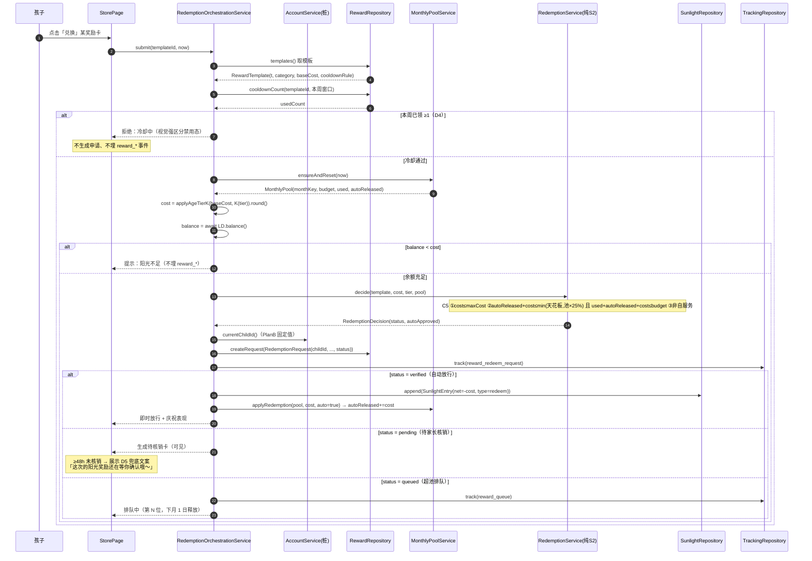
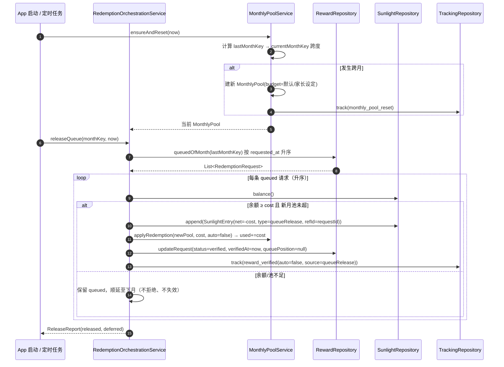
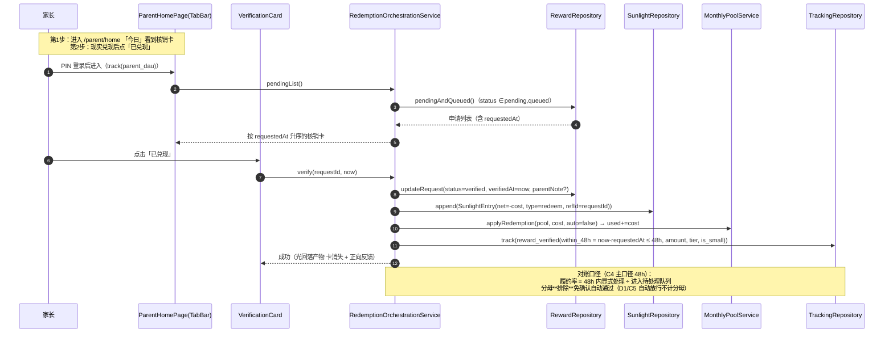
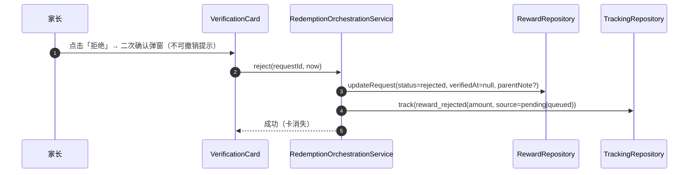
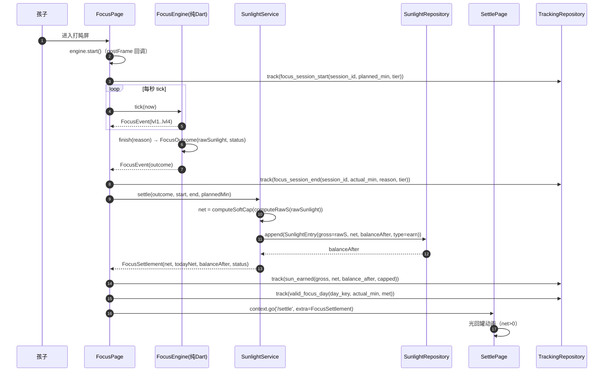
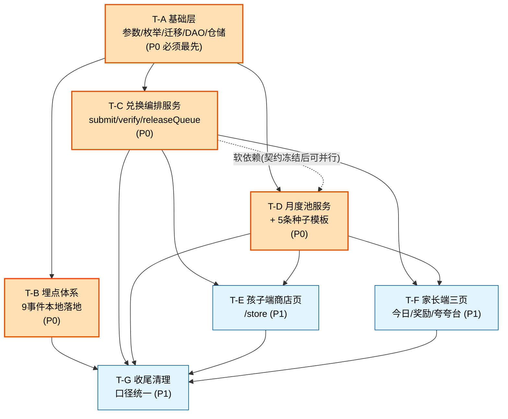

# 《向日葵专注 SunFocus》M2 经济与商店核销 · 软件设计文档

> 版本：v1.0 ｜ 日期：2026-09-18 ｜ 作者：架构师 高见远（Bob）
> 输入：PRD v2.0（8 模块 + 9 事件埋点 + P0/P1/P2 + UI 稿）、`docs/MVP执行规划_v2.md`、`docs/口径裁定表_v1.md`、`docs/架构设计_SunFocus_MVP.md`、M2 代码现状侦察报告
> **本次锁定输入：玄参大人拍板的 5 项产品决策（全文 §0）**
> 分工备注：本文件对应 `docs/软件设计文档_M0.md` / `_M1.md` 的同列文档，为 M2 的**唯一设计真源**；代码实现由此展开。

---

## 0. 五项产品决策（本次设计的前提，不可推翻）

| # | 决策 | 设计落点 |
|---|---|---|
| **D1** | C5 分母 = **40**（`kAutoApproveCapCeilingLow=40`）；全仓 grep 清掉任何 `20` 裸字面量 | 确认现有实现已是 40；需清理 `redemption_service_test.dart` 中遗留的「20」注释与任何 `20` 字面量（T-G） |
| **D2** | 分龄 K = **[低 1.0 / 中 1.2 / 高 1.5]**，分档 **6–8 / 9–10 / 11–12 岁** | 新增 `AgeTier.mid`（三档）+ `kAgeTierParams` 参数包；`applyAgeTierK` 接真实 K（§1.3、T-A） |
| **D3** | 奖励表**先放 3–5 条占位模板** | `RewardTemplate` 加 `cooldownRule` + `baseCost`；新增种子数据（T-D） |
| **D4** | 冷却：**每奖励每周限领 1 次**（`frequencyLimitPerWeek=1`） | 默认系数 entitlement 定为 1 次/自然周；`CooldownCounter` 计数（T-C/T-D） |
| **D5** | 48h 兜底文案 = **「这次的阳光奖励还在等你确认哦～」** | 新增 `kPendingReminderHours=48`、`kPendingReminderText`（常量单点在 `prd_params.dart`）；子端卡面展示（T-F/T-E） |

---

## 1. 实现方案与技术选型

### 1.1 沿用（不更换）

沿用并仅在既有框架内扩展，**不引入新架构范式**：

- **Flutter + Dart 3**（现有）
- **flutter_riverpod ^2.5.0**：DI 与状态（`core/di/providers.dart` 已装配全部 Repository）
- **go_router ^14**：路由（M2 新增 `/store`；家长端采用 `/parent/home` + TabBar）
- **drift ^2.20 + sqlcipher_flutter_libs ^0.5**：本地加密库（§10.4 C13 合规义务，不得替换）
- **uuid / intl / crypto / path_provider / just_audio**：沿用

选型理由：M0/M1 已用这套跑通「专注闭环 + 加密存储 + PIN 锁 + 同意流」，且 Drift 已建好 M2 所需的全部 10 张表（侦察结论 §5）。换技术栈会重做 §10.4 C13 加密合规与屏幕交互检测基线，收益为负。

### 1.2 三个关键技术难点

| 难点 | 方案 |
|---|---|
| **① S2 纯判定如何升级为完整兑换链路** | S2 的 `RedemptionService.decide()` 是**纯函数、不落库**。M2 在其**之上**新增 `RedemptionOrchestrationService`（编排层）：读模板 → 算含 K 价 → 取/建月度池 → `decide()` → 落 `RedemptionRequest` → 扣账本 → 更新池 → 埋点。**不改动 `decide()` 的判定语义**，保证 S2 现有 13 条单测继续通过、成为回归基线。 |
| **② 排队（queued）请求的跨月释放** | 架构 §4.1 要求的 `releaseQueue()` 尚不存在（侦察缺口）。新增：超池时**不扣账本、不扣池**；每月 1 日 0 点按 `requested_at` **升序**释放，逐条写 `ledger(net=-cost, type=queueRelease)` + 新月 `used+=cost`；启动时按 `datetime_ext` 补跑（长期不开 App 场景）。 |
| **③ 埋点落地方式（Plan B）** | **不接 firebase / 任何云服务**。9 个事件全部落本地 `TrackingEvents` 表（payload JSON），附 **JSONL 导出能力**（写应用文档目录，可后续加 share/导出 UI）。理由：Plan B 单机版 + C13 数据最小化，引入 SDK 会带来合规与包体成本且不可逆；本地落表已满足 G2「埋点完成 + 1 周校准」的可导出/可校验要求。后续若要联网，只需替换 `TrackingRepository` 实现（领域层零改动）。 |

### 1.3 三档 AgeTier 改造（D2）— **本次最高风险改动**

现状：`enum AgeTier { low, high }`（index 0/1），且 **`Settings.ageTier` 以 int index 落库**，`settings_local_repository` 用 `row.ageTier == 0 ? low : high` 做**双向映射**，同时 `RedemptionService.decide()` 用两个三元表达式按档取参。

**方案：改为 `enum AgeTier { low, mid, high }`（0/1/2）**，并配套三件事：

1. **数据迁移（强制、不可省）**：既有库里 `age_tier=1` 表示 `high`；新枚举下 `1` 表示 `mid`。必须在 schema v1→v2 迁移中执行
   `UPDATE settings SET age_tier = 2 WHERE age_tier = 1;`
   漏此步会导致 **9–12 岁用户被静默降档**，影响 C5 免确认额度与 K。
2. **单点参数表取代散落三元**：新增 `AgeTierParams` + `kAgeTierParams` 映射（见 §3.2），`decide()` 与 `applyAgeTierK` 全部改为查表，`settings_local_repository` 改用 `AgeTier.values[index]` 双向映射（不再写死三元）。
3. **影响面审计（已完成）**：`anti_addiction_service.dart` **不使用 AgeTier**（安全）；受影响文件仅 4 处：`enums.dart`、`tables.dart`、`settings_local_repository.dart`、`redemption_service.dart`（+ 新增 age_tier_params）。

### 1.4 为什么不引入全局状态容器 / 事件总线

M2 的跨模块联动（兑换→扣阳光→更新池→埋点）集中在单次用户动作内，用 `RedemptionOrchestrationService` 显式编排即可，无需事件总线。引入总线会让「哪一条 ledger 记录对应哪一笔核销」这类**对账可追溯性**变差，与架构 §3.2「三套规则可追溯对账」铁律冲突。

---

## 2. 文件清单（相对路径）

> 图例：**[新]** 新建 ｜ **[改]** 修改 ｜ **[删]** 删除。所有路径相对仓库根。

### 2.1 常量 / 参数单点
| 路径 | 操作 | 说明 |
|---|---|---|
| `lib/core/constants/prd_params.dart` | [改] | 新增 `kPendingReminderHours=48`、`kPendingReminderText`、`kChildIdDefault`、`kCooldownWeeklyDefault=1`、月度池/冷却相关；**保留现有 C5 全套**（T-G 做去重与 `20` 清理） |
| `lib/core/constants/app_constants.dart` | [改] | 删除 `kAutoConfirmMonthlyPct`（与 `prd_params.kAutoApprovePoolRatio` 孪生）→ T-G；`kCurrencyRate` 裁定（T-G） |
| `lib/core/constants/age_tier_params.dart` | **[新]** | `AgeTierParams` + `kAgeTierParams` + `tierForAge(int)` + `ageTierK(tier)`（D2 唯一真源） |

### 2.2 领域实体 / 枚举
| 路径 | 操作 | 说明 |
|---|---|---|
| `lib/domain/entities/enums.dart` | [改] | `AgeTier` 增 `mid`；新增 `CooldownRule{weekly,monthly,none}`（`CooldownPeriod` 仍用于 CooldownCounter） |
| `lib/domain/entities/reward_template.dart` | [改] | 加 `cooldownRule`（D3）、`baseCost`（含 K 前的基准价，D2）；`baseCostHigh/Low` 标记待废弃 |
| `lib/domain/entities/redemption_request.dart` | [改] | 加 `childId`（C1/D2 要求的 account 预留）、`parentNote`（表已有列、实体补齐） |
| `lib/domain/entities/monthly_pool.dart` | [改] | 加 `resetAt`（表已有列、实体补齐） |
| `lib/domain/entities/tracking_event.dart` | [改] | 加 `name`（事件名，供查询/导出）与命名构造器 |

### 2.3 数据层（Drift）
| 路径 | 操作 | 说明 |
|---|---|---|
| `lib/data/local/database/tables.dart` | [改] | `RedemptionRequests` 加 `childId` 列；`RewardTemplates` 加 `cooldownRule`、`baseCost` 列 |
| `lib/data/local/database/app_database.dart` | [改] | `schemaVersion` **1 → 2** + migration（加列 + `age_tier` 重编号） |
| `lib/data/local/database/daos.dart` | [改] | 追加 5 个 DAO：`RewardTemplateDao`、`RedemptionRequestDao`、`MonthlyPoolDao`、`CooldownCounterDao`、`TrackingEventDao` |
| `lib/data/local/repositories/local_stub_repositories.dart` | [改] | 移除 `RewardLocalRepositoryStub`、`TrackingLocalRepositoryStub`（被真实实现替换） |
| `lib/data/local/repositories/reward_local_repository.dart` | **[新]** | 真实实现（模板/请求/冷却） |
| `lib/data/local/repositories/monthly_pool_local_repository.dart` | **[新]** | 真实实现（按 monthKey 读/upsert） |
| `lib/data/local/repositories/tracking_local_repository.dart` | **[新]** | 真实实现（落 TrackingEvents + JSONL 导出） |

### 2.4 领域服务 / 接口
| 路径 | 操作 | 说明 |
|---|---|---|
| `lib/domain/services/redemption_service.dart` | [改] | `decide()` 内部改查 `kAgeTierParams`（外部签名/语义不变） |
| `lib/domain/services/redemption_orchestration_service.dart` | **[新]** | **核心**：submit / verify / releaseQueue / pendingList |
| `lib/domain/services/monthly_pool_service.dart` | **[新]** | 取/建/重置月度池 + C5 上限计算 |
| `lib/domain/services/account_service.dart` | **[新]** | C1 留桩：Plan B 抛 `UnsupportedInPlanB`（此前全仓零命中，属补齐） |
| `lib/domain/repositories/reward_repository.dart` | [改] | 扩 `queuedOfMonth` / `cooldownCount` / `monthlyPoolTemplates` 等 |
| `lib/domain/repositories/monthly_pool_repository.dart` | **[新]** | 月度池仓储接口 |
| `lib/core/utils/math_ext.dart` | [改] | `applyAgeTierK` 接真实 K；移除占位 `autoApproveMonthlyCap`（能力并入 `MonthlyPoolService`） |

### 2.5 表现层 / 路由 / 装配
| 路径 | 操作 | 说明 |
|---|---|---|
| `lib/shared/app_router.dart` | [改] | 新增 `/store` 路由 |
| `lib/presentation/child/pages/store_page.dart` | **[新]** | 阳光商店（发起兑换 / 奖励表 / 冷却态 / 48h 兜底提示） |
| `lib/presentation/child/widgets/reward_card.dart` | **[新]** | 奖励卡（含冷却态视觉强区分） |
| `lib/presentation/parent/pages/parent_home_page.dart` | [改] | 改为 `TabBar` 壳，承载三页 |
| `lib/presentation/parent/pages/parent_today_page.dart` | **[新]** | 今日（含核销卡） |
| `lib/presentation/parent/pages/parent_reward_page.dart` | **[新]** | 奖励配置 + 核销 + 月度池指示 |
| `lib/presentation/parent/pages/parent_praise_page.dart` | **[新]** | 夸夸台 |
| `lib/presentation/parent/widgets/verification_card.dart` | **[新]** | 核销卡（≤2 步） |
| `lib/presentation/parent/widgets/pool_indicator.dart` | **[新]** | 月度池用量指示 |
| `lib/presentation/child/pages/focus_page.dart` | [改] | 插入 `focus_session_start` / `focus_session_end` 埋点 |
| `lib/presentation/child/pages/settle_page.dart` | [改] | 插入 `sun_earned` / `valid_focus_day` 埋点 |
| `lib/presentation/parent/pages/parent_login_page.dart` | [改] | 插入 `parent_dau` 埋点 |
| `lib/core/di/providers.dart` | [改] | 装配新 Repo/Service，替换桩，`account_service` 留桩注册 |
| `lib/data/local/repositories/reward_seed.dart` | **[新]** | 5 条占位奖励模板种子（D3/D4） |

### 2.6 测试
| 路径 | 操作 | 说明 |
|---|---|---|
| `test/m2/age_tier_params_test.dart` | **[新]** | 三档映射 + K + migration 期望值 |
| `test/m2/monthly_pool_service_test.dart` | **[新]** | 重置/补跑/C5 上限 |
| `test/m2/redemption_orchestration_test.dart` | **[新]** | submit/verify/releaseQueue 全路径（S2 13 测之外的新路径） |
| `test/m2/tracking_test.dart` | **[新]** | 9 事件落表 + 导出 |
| `test/m2/reward_dao_test.dart` | **[新]** | Drift 内存库 DAO 测试（含 migration v1→v2） |
| `test/m2/store_page_test.dart` | **[新]** | 首个 widget 测试（补 M1 空白） |
| `test/redemption_service_test.dart` | [改] | 清理「20」注释（D1）；确认 13 条仍绿 |

---

## 3. 数据结构与接口

### 3.1 类图（完整）

```mermaid
classDiagram
    direction TB

    class AppSettings {
        +AgeTier ageTier
        +int monthlyPoolBudget
        +int autoConfirmSingleHigh
        +int autoConfirmSingleLow
        +double autoConfirmMonthlyPct
        +double currencyRate
        +copyWith(...) AppSettings
    }

    class AgeTier {
        <<enumeration>>
        low
        mid
        high
    }

    class RewardCategory {
        <<enumeration>>
        selfService
        parentHandled
    }

    class RequestStatus {
        <<enumeration>>
        pending
        queued
        verified
        rejected
    }

    class CooldownRule {
        <<enumeration>>
        none
        weekly
        monthly
    }

    class SunlightType {
        <<enumeration>>
        earn
        redeem
        queueRelease
    }

    class TrackingType {
        <<enumeration>>
        milestone
        metric
    }

    class AgeTierParams {
        +int ageMin
        +int ageMax
        +double k
        +int autoApproveMaxCost
        +int autoApproveCapCeiling
        +int monthlyPoolDefault
        +int dailyFocusCap
    }

    class kAgeTierParams {
        <<const map>>
        +byTier(AgeTier) AgeTierParams
    }
    class AgeTierFn {
        <<functions>>
        +tierForAge(int age) AgeTier
        +ageTierK(AgeTier tier) double
        +capFor(AgeTier tier, int budget) int
    }

    class RewardTemplate {
        +String id
        +String name
        +RewardCategory category
        +int baseCost
        +int frequencyLimitPerWeek
        +CooldownRule cooldownRule
        +bool enabled
    }

    class RedemptionRequest {
        +String id
        +String childId
        +String templateId
        +DateTime requestedAt
        +int cost
        +RequestStatus status
        +bool autoApproved
        +int? queuePosition
        +DateTime? verifiedAt
        +String? parentNote
    }

    class MonthlyPool {
        +String monthKey
        +int budget
        +int used
        +int autoReleased
        +DateTime? resetAt
    }

    class CooldownCounter {
        +String templateId
        +CooldownPeriod period
        +int usedCount
    }

    class TrackingEvent {
        +String id
        +String name
        +TrackingType type
        +DateTime ts
        +Map~String,dynamic~ payload
    }

    class SunlightEntry {
        +String id
        +DateTime ts
        +SunlightType type
        +double gross
        +double net
        +double balanceAfter
        +String? refType
        +String? refId
        +String dayKey
    }

    class RedemptionDecision {
        +RequestStatus status
        +bool autoApproved
        +String reason
    }

    %% 纯判定层（S2 既有，语义不变）
    class RedemptionService {
        <<static / pure>>
        +decide(template, cost, ageTier, pool) RedemptionDecision
    }

    %% 编排层（M2 新建）
    class RedemptionOrchestrationService {
        -RewardRepository _rewards
        -MonthlyPoolService _pools
        -SunlightRepository _ledger
        -TrackingRepository _tracking
        +submit(templateId, ageTier, now) Future~SubmitResult~
        +verify(requestId, now) Future~void~
        +releaseQueue(monthKey, now) Future~ReleaseReport~
        +pendingList() Future~List~RedemptionRequest~~
        +_priceFor(tpl, tier) int
        +_checkCooldown(tpl, now) Future~bool~
    }

    class MonthlyPoolService {
        -MonthlyPoolRepository _repo
        +ensureAndReset(now) Future~MonthlyPool~
        +pool(monthKey) Future~MonthlyPool~
        +autoApproveCap(pool, tier) int
        +applyRedemption(pool, cost, auto) Future~void~
    }

    class MonthlyPoolRepository {
        <<interface>>
        +get(monthKey) Future~MonthlyPool?~
        +upsert(pool) Future~void~
        +monthsBetween(fromKey, toKey) List~String~
    }

    class RewardRepository {
        <<interface>>
        +templates() Future~List~RewardTemplate~~
        +saveTemplate(t) Future~void~
        +createRequest(r) Future~void~
        +pendingAndQueued() Future~List~RedemptionRequest~~
        +queuedOfMonth(monthKey) Future~List~RedemptionRequest~~
        +updateRequest(r) Future~void~
        +cooldownCount(templateId, window) Future~int~
    }

    class TrackingRepository {
        <<interface>>
        +track(TrackingEvent) Future~void~
        +eventsOfType(TrackingType) Future~List~TrackingEvent~~
        +exportJsonl(from, to) Future~String~
    }

    class SunlightRepository {
        <<interface / existing>>
        +append(SunlightEntry) Future~double~
        +balance() Future~double~
        +dayNet(dayKey) Future~double~
        +verifiedRedeemTotal() Future~double~
    }

    class AccountService {
        <<PlanB stub>>
        +currentChildId() String
        +signIn() Never
        +linkFamily() Never
        +syncProfile() Never
    }

    %% 数据层实现
    class RewardLocalRepository {
        <<implements RewardRepository>>
    }
    class MonthlyPoolLocalRepository {
        <<implements MonthlyPoolRepository>>
    }
    class TrackingLocalRepository {
        <<implements TrackingRepository>>
    }
    class RewardTemplateDao {
        +all() +watchEnabled() +upsert()
    }
    class RedemptionRequestDao {
        +insert() +update()
        +pendingAndQueued() +queuedOfMonth()
    }
    class MonthlyPoolDao {
        +of(monthKey) +upsert()
    }
    class CooldownCounterDao {
        +bump(templateId, period) +count(templateId, window)
    }
    class TrackingEventDao {
        +insert() +ofType() +inRange()
    }
    class AppDatabase {
        +int schemaVersion = 2
        +MigrationStrategy migration
    }

    %% UI
    class StorePage {
        +build()
    }
    class ParentHomePage {
        +TabBar today/reward/praise
    }
    class VerificationCard {
        +onVerified()
    }

    %% 关系
    RedemptionOrchestrationService ..> RedemptionService : 调用 decide()
    RedemptionOrchestrationService --> MonthlyPoolService : 依赖
    RedemptionOrchestrationService --> RewardRepository : 依赖
    RedemptionOrchestrationService --> SunlightRepository : 扣账本
    RedemptionOrchestrationService --> TrackingRepository : track()
    MonthlyPoolService --> MonthlyPoolRepository : 依赖
    RedemptionOrchestrationService ..> AccountService : currentChildId()

    RewardLocalRepository ..|> RewardRepository
    MonthlyPoolLocalRepository ..|> MonthlyPoolRepository
    TrackingLocalRepository ..|> TrackingRepository

    RewardLocalRepository --> RewardTemplateDao
    RewardLocalRepository --> RedemptionRequestDao
    RewardLocalRepository --> CooldownCounterDao
    MonthlyPoolLocalRepository --> MonthlyPoolDao
    TrackingLocalRepository --> TrackingEventDao
    AppDatabase --> RewardTemplateDao
    AppDatabase --> RedemptionRequestDao
    AppDatabase --> MonthlyPoolDao
    AppDatabase --> CooldownCounterDao
    AppDatabase --> TrackingEventDao

    AppSettings --> AgeTier
    AppSettings ..> MonthlyPool : budget 默认值来源
    kAgeTierParams --> AgeTierParams
    kAgeTierParams --> AgeTier
    AgeTierFn ..> kAgeTierParams
    RedemptionService ..> kAgeTierParams : 取代三元
    AgeTierFn ..> RewardTemplate : K 作用价格
    RewardTemplate --> RewardCategory
    RewardTemplate --> CooldownRule
    RedemptionRequest --> RequestStatus
    RedemptionRequest ..> RewardTemplate : templateId
    MonthlyPool ..> RedemptionRequest : used/autoReleased 由此累计
    RedemptionService ..> RedemptionDecision
    RedemptionDecision --> RequestStatus
    TrackingEvent --> TrackingType
    SunlightEntry --> SunlightType
    StorePage ..> RedemptionOrchestrationService : submit()
    ParentHomePage ..> RedemptionOrchestrationService : verify()
    VerificationCard ..> ParentHomePage
    MonthlyPoolService ..> AgeTierParams : cap 计算
```



### 3.2 关键接口约定

**AgeTierParams（D2 唯一真源，`age_tier_params.dart`）**

```dart
class AgeTierParams {
  final int ageMin, ageMax;        // 年龄区间（含端点）
  final double k;                  // 分龄系数 K：低1.0 / 中1.2 / 高1.5（D2）
  final int autoApproveMaxCost;    // C5① 单笔候选阈值
  final int autoApproveCapCeiling; // C5② 固定天花板（低=40 / 高=100，D1）
  final int monthlyPoolDefault;    // 月度池默认（低160 / 高400）
  final int dailyFocusCap;
}
const Map<AgeTier, AgeTierParams> kAgeTierParams = { AgeTier.low: ..., AgeTier.mid: ..., AgeTier.high: ... };
AgeTier tierForAge(int age) => /* 6–8=low, 9–10=mid, 11–12=high（越界取最近端点） */;
double ageTierK(AgeTier t) => kAgeTierParams[t]!.k;
int    capFor(AgeTier t, int budget) { final p = kAgeTierParams[t]!;
  final fromPool = (budget * kAutoApprovePoolRatio).floor();
  return fromPool < p.autoApproveCapCeiling ? fromPool : p.autoApproveCapCeiling; }
```

> ⚠️ 中档（mid）的 `autoApproveMaxCost / autoApproveCapCeiling / monthlyPoolDefault / dailyFocusCap` **未被 5 项决策覆盖** → 见 §8 待明确 U1。本设计给出保守默认（见 U1），改动只需动 `kAgeTierParams` 一行。

**价格计算（消耗侧才乘 K，产出侧不乘——架构 §0）**

```dart
int costFor(RewardTemplate t, AgeTier t) =>
    applyAgeTierK(t.baseCost.toDouble(), ageTierK(t)).round();   // K 仅作用消耗侧
```

**月度池 key**：`monthKey(DateTime)` 采用 `'yyyy-MM'`（复用现有 `core/utils/datetime_ext.dart` 的 `dayKey` 同级约定，新增 monthKey 函数或与 T-A 一并补）。

### 3.3 9 个埋点事件的注入点（T-B）

| 事件 | 注入点 | 关键 payload（口径见验证计划 §3.2，一字不改） |
|---|---|---|
| `focus_session_start` | `FocusPage.initState` → `_engine.start()` 后 | session_id, planned_min, tier |
| `focus_session_end` | `FocusPage._handleOutcome` 起点 | session_id, actual_min, reason, tier |
| `valid_focus_day` | `settle_page` 结算后判定 | day_key, actual_min, met(bool)（≥15min 且完成率≥0.90） |
| `sun_earned` | `SunlightService.settle()` 返回处 / settle_page | gross, net, balance_after, capped(bool) |
| `reward_redeem_request` | `submit()` 落库后 | reward_id, cost_sun, category, tier, is_auto_pass |
| `reward_verified` | `verify()` 成功后 | request_id, verify_ts, within_48h, amount, tier, is_small |
| `reward_queue` | `submit()` 判为 queued 时 | request_id, queue_rank, month |
| `monthly_pool_reset` | `MonthlyPoolService.ensureAndReset` 发生跨月时 | pool_size, tier |
| `parent_dau` | `parent_login_page` PIN 校验通过 | ts, tier |

---

## 4. 程序调用流程

### 4.1 ① 孩子端发起兑换（含免确认自动放行 / 待核销 / 排队三条分支）



### 4.2 ② 跨月 `releaseQueue()`（含长期不开 App 的补跑）



### 4.3 ③ 家长核销 `verify()`（48h 主口径，≤2 步）



### 4.3.1 ④ 家长拒绝 `reject()`（阳光原路返回，不扣）

家长因现实原因无法兑现某奖励时，需要「拒绝」入口（PRD §10.4 /《个保法》第 31 条：必须提供拒绝选项）。
拒绝与核销互斥：二者任一成功后该卡即从「今日」消失。



**关键不变式**：pending / queued 状态**从不触发 ledger 扣减**（见 §3.2「排队不提前扣」纪律），
因此拒绝 = 从不做扣减，阳光自然「原路返回」孩子（不写任何 refund ledger）。被拒申请退出
`pendingAndQueued()` 列表 → 孩子端商店同一奖励卡恢复可兑换。这与「核销履约率」分母口径一致：
拒绝计入家长显式处理（分子），分母仍为进入待处理队列的申请（排除免确认自动通过）。

### 4.4 ④ M1 focus/settle 链路插入埋点（9 事件中的 4 个）



---

## 5. 任务分解与依赖图

### 5.1 任务列表（**T-A 先行，B/C/D 并行，E/F 继起，G 收口**）

| 任务 | 名称 | 负责文件（独占，防合并冲突） | 依赖 | 优先级 |
|---|---|---|---|---|
| **T-A** | **基础层：参数/枚举/表迁移/DAO/仓储替换桩** | `prd_params.dart`、`age_tier_params.dart`(新)、`app_constants.dart`(仅增)、`enums.dart`、`tables.dart`、`app_database.dart`(v1→v2+migration)、`daos.dart`(5 个 DAO 全在此)、实体 3 个、`redemption_service.dart`(内部改查表)、`local_stub_repositories.dart`(删 2 桩)、`math_ext.dart`、`reward_repository.dart`(接口扩)、`monthly_pool_repository.dart`(新)、`reward_local_repository.dart`(新)、`monthly_pool_local_repository.dart`(新)、`account_service.dart`(新) | **无（必须最先）** | **P0** |
| **T-B** | **埋点体系（Plan B 本地落地）** | `tracking_event.dart`、`tracking_repository.dart`、`tracking_local_repository.dart`(新)、`TrackingEventDao`(由 T-A 提供)、`focus_page.dart`(插 2 点)、`settle_page.dart`(插 2 点)、`parent_login_page.dart`(插 1 点)、`test/m2/tracking_test.dart` | T-A（TrackingEventDao + 实体） | **P0** |
| **T-C** | **兑换编排服务** | `redemption_orchestration_service.dart`(新)、`RedemptionRequestDao`/`RewardTemplateDao`/`CooldownCounterDao`(由 T-A 提供)、`providers.dart`(装配段)、`test/m2/redemption_orchestration_test.dart` | T-A（硬）；T-D（软：接口契约见 §3.2，冻结后可并行） | **P0** |
| **T-D** | **月度池服务 + 种子数据** | `monthly_pool_service.dart`(新)、`reward_seed.dart`(新，5 条占位模板 D3/D4)、`MonthlyPoolDao`(由 T-A 提供)、`test/m2/monthly_pool_service_test.dart`、`test/m2/age_tier_params_test.dart` | T-A（硬） | **P0** |
| **T-E** | **孩子端商店页（`/store`）** | `store_page.dart`(新)、`reward_card.dart`(新)、`app_router.dart`(`/store` 路由段) | T-C、T-D | P1 |
| **T-F** | **家长端三页（今日/奖励/夸夸台）** | `parent_home_page.dart`(改 TabBar 壳)、`parent_today_page.dart`、`parent_reward_page.dart`、`parent_praise_page.dart`、`verification_card.dart`、`pool_indicator.dart`(均新) | T-C、T-D（D5 文案常量由 T-A 提供） | P1 |
| **T-G** | **收尾：口径统一与清理** | `prd_params.dart`、`app_constants.dart`（去重/裁定）、各测试文件收尾；跑 §7 口径巡检 grep | **全部任务之后** | P1 |

### 5.2 并行编排建议（给主理人派工用）

```
批次 1（串行，仅 1 人）： T-A
批次 2（并行 3 人）：    T-B（埋点） ‖ T-C（编排） ‖ T-D（月度池+种子）
批次 3（并行 2 人）：    T-E（商店页） ‖ T-F（家长端）
批次 4（收口 1 人）：    T-G
```

- **T-C 与 T-D 并行前提**：`MonthlyPoolService` 的接口签名以 §3.2 为准**先行冻结**（`ensureAndReset / pool / autoApproveCap / applyRedemption`），双方按契约各自写单测，集成点在 `providers.dart`（由 T-C 统一装配，避免多人改同一文件）。
- **`providers.dart` 归属**：由 **T-C** 统一负责装配；T-B/T-D/T-F 若需新增 provider，向 T-C 提诉求，避免冲突。
- **`app_router.dart` 归属**：T-E 加 `/store`；T-F 复用既有 `/parent/home`（不改路由表，规避 B19/B20 已修复的返回栈陷阱）。
- **Migration 风险单点**：T-A 必须附 `test/m2/reward_dao_test.dart` 覆盖 v1→v2 与 `age_tier` 重编号，否则 §1.3 的静默降档风险不可验收。

### 5.3 任务依赖图



---

## 6. 依赖包列表

**结论：M2 需要新增的包极少——现有依赖已覆盖绝大部分。**

| 包 | 版本 | 状态 | 用途 |
|---|---|---|---|
| `drift` | ^2.20.0 | 沿用 | 新增 5 个 DAO |
| `drift_dev` / `build_runner` | ^2.20 / ^2.4 | 沿用（dev） | **必须重跑代码生成**（`flutter pub run build_runner build --delete-conflicting-outputs`），否则 `.g.dart` 不含新 DAO/migration |
| `sqlcipher_flutter_libs` | ^0.5.0 | 沿用 | C13 加密，不动 |
| `go_router` | ^14.0.0 | 沿用 | `/store` 路由 |
| `flutter_riverpod` | ^2.5.0 | 沿用 | DI 装配 |
| `uuid` / `intl` / `crypto` / `path_provider` | 现有 | 沿用 | ID / 月 Key / 导出路径 |
| `test` / `flutter_test` | 现有 | 沿用 | 单测 + 首个 widget 测试 |
| **`share_plus`** | ^7.0.0 | **[建议新增，可选]** | 埋点 JSONL 导出后分享/发送。**不引入则仍可写文件到应用目录**，导出能力降级为「文件可取」；建议 T-B 视实际需要决定是否引入 |

**明确不引入**：`firebase_analytics` / `firebase_core` / 任何云分析 SDK（Plan B + C13 数据最小化，见 §1.2 难点③）。`csv` 也不需要（导出用 `dart:convert` 写 JSONL）。

> ⚠️ 注意 `pubspec.yaml` 的历史坑：**不得**同时引入 `sqlite3_flutter_libs` 与 `sqlcipher_flutter_libs`（Android namespace 冲突导致构建失败）。

---

## 7. 共享知识（全体工程师必读）

1. **常量单点**：所有可调数值必须来自 `core/constants/prd_params.dart` 或 `app_constants.dart`，逐条注释 PRD / 裁定节号。任何文件出现第二个同义字面量 = 缺陷（口径裁定总纪律 #2）。`age_tier_params.dart` 是**三档参数的唯一真源**，禁止在业务代码里写 `== AgeTier.high ? A : B` 三元。
2. **冲突裁决优先级**：`MVP执行规划_v2` > `口径裁定表_v1` > 开发计划 v1.0 > 验证计划 > PRD v2.0。有冲突先查这张表，不要自行推断。
3. **K 只作用于消耗侧**（架构 §0）：产出侧阳光一律 `1/min` 不乘 K；只有奖励的 baseCost → cost 才乘 K（`costFor()`）。
4. **ledger 单一账本 + 月池独立对账**（§3.2）：每笔兑换无论哪种来源（自动放行 / 家长核销 / 次月排队释放）都必须写一条 `SunlightEntry`（`type` 分别为 `redeem`/`redeem`/`queueRelease`），并保证池账 `used + autoReleased ≤ budget`、账本 `balance ≥ 0`。**queued 状态绝不提前扣账本/扣池**。
5. **track() 调用约定**：领域服务只依赖 `TrackingRepository` 接口；事件名用常量（`TrackingEventNames.*`，单点定义），payload 字段名与《验证计划 §3.2》**一字不改**；9 个事件缺一中任意一个，G2 不得起跑。
6. **childId 固定值**（Plan B 单孩子）：`AccountService.currentChildId()` 返回 `prd_params.kChildIdDefault` 常量；`signIn/linkFamily/syncProfile` 一律抛 `UnsupportedInPlanB`。RedemptionRequest 必须落 `childId`，为 V2 多档案留口，不得省略。
7. **错误/边界处理约定**：① 阳光不足 → 不生成申请；② 冷却未过 → 不生成申请（卡面视觉强区分，禁用态）；③ 队列释放遇余额不足 → 顺延下月，**不拒绝、不失效**；④ `decide()` 保持纯函数不落库，落库只发生在编排层；⑤ 任何 DAO 异常不得吞掉，向上抛并由 UI 降级提示。
8. **不要回退的既有修复**：B18/B19/B20（方向与返回栈）、B25（分钟格式化）、B27/B30（欢迎光晕/DND）、B32（结算页向日葵常驻）、P1/P2-1（离席 tick 与斜坡积分）。涉及 `focus_page`/`settle_page` 的改动（尤其 T-B 插埋点）**只能新增行，不得重构既有逻辑**。
9. **migration 纪律**：`schemaVersion` 升到 **2**，含 `ALTER TABLE` 加列 + `UPDATE settings SET age_tier=2 WHERE age_tier=1`。任何 schema 改动必须配 `test/m2/reward_dao_test.dart` 用例。

---

## 8. 待明确事项（需主理人/产品确认）

| # | 事项 | 现状与建议 |
|---|---|---|
| **U1** | **中档（9–10 岁）的 C5 参数与月度池默认值未被覆盖**：D2 只给了 K=1.2，未给 `autoApproveMaxCost` / `autoApproveCapCeiling` / `monthlyPoolDefault` / `dailyFocusCap` | **建议默认：中档全部沿用「低档」取值（50 / 40 / 160 / 90）**——理由：低档即最严档，9–10 岁暂按最严执行更安全；且**不发明新数字**，完全复用已有点，符合单点纪律。若产品后续要给中档插值（如 90/70/280），只需改 `kAgeTierParams` 一行。**请确认采用保守默认值。** |
| **U2** | 验证计划 §4.3 DoD 写的是「商店页 + 奖励定价表 **§4.8 全 11 项**」，但 D3 本次决定「先放 3–5 条占位模板」 | 以 **D3 为准**（占位优先），全 11 项作为 `reward_seed.dart` 的数据扩展待办，不改变任何代码结构。请确认。 |
| **U3** | `frequencyLimitPerWeek`(已有字段) 与 D3 新增的 `cooldownRule`(周期枚举) 存在语义重叠 | 本设计双字段并存：`frequencyLimitPerWeek=1`（D4 硬约束）+ `cooldownRule=CooldownRule.weekly`（周期，供未来 monthly 扩展）。若产品更倾向单一字段（`frequencyLimit` + `cooldownPeriod`），可在 T-A 一并收敛——建议维持双字段以最小改动满足决策。 |
| **U4** | `parent_dau` 的「日活跃」判定口径 | 本设计取「PIN 校验通过并进入 `/parent/home`」**单次/日去重**（本地按 dayKey 落一条）。若需改为「打开次数」请确认。 |
| **U5** | 埋点导出是否引入 `share_plus` | 不引入也能用（写应用文档目录）；引入才有「分享/导出到外部」的完整体验。建议 M2 **先不引入**（避免依赖与合规面扩大），标记为 M3/M4 待办。 |

---

*本文档为 M2 唯一设计真源。实现过程中若发现本文档与 PRD/裁定冲突，按 §7 第 2 条优先级裁决并回报主理人修订本文。*
